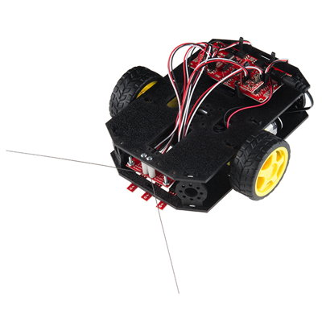
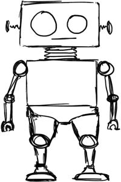

# Project Introduction



## I, Robot

Robotic devices are becoming increasingly used in a variety of contexts to perform tasks and solve problems. In this project, students will be introduced to physical computing by designing and programming a two-wheeled robot prototype to perform useful tasks for people.

## Robotics Kit

This project is tailored for a two-wheeled robotics kit called the [SparkFun Inventor's Kit for RedBot](https://www.sparkfun.com/products/12649). It is highly recommended to add an [ultrasonic sensor](https://docs.idew.org/code-robotics/references/physical-inputs/ultrasonic-sensor) to the RedBot for more design possibilities.

**However, you may use another wheeled robot of your choice for this project**. If the robot is programmed using Arduino, you may be able to use \(or modify\) the tutorials and references in the accompanying [Robotics Code Guidebook](https://docs.idew.org/code-robotics/) \(depending on the particular components and capabilities of your robot\).

## What is a Robot?

Most people picture a human-like robot when they think of a "robot" – however, robotic devices vary widely in their purpose, size, capabilities, etc. Some robots have arms for grabbing or gripping objects. Some robots have wheels or legs for moving on surfaces. Some robots have propellors for moving through the air or water. It can be challenging to define what a robot is.

However, most people that study and create robotic devices generally agree that robots are physical computing devices that follow a "sense-think-act" cycle to autonomously interact with the physical world.

* **SENSE:**  Robotic devices typically have one or more **physical inputs** \(such as sensors, etc.\) that gather data from the physical environment.
* **THINK:**  Robotic devices are programmed to analyze data from their inputs to make decisions and respond to certain conditions by acting through their outputs.
* **ACT:**  Robotic devices typically have one or more **physical outputs** \(such as motors, etc.\) that can perform movements and actions in the physical environment.

The "Think" component requires a robot to be **autonomous** – it is programmed with an "artificial intelligence" to make its own decisions based on data. In some cases, this AI may be a relatively simple algorithm or program that only performs a specific task. In other cases, this AI may be capable of much more complex and adaptable behaviors.


**ROBOT VS. NOT ROBOT:** If a device's actions are being decided and controlled directly by a human, then the device would **not** be considered a robot.  For example, a remote-controlled drone is not a true robot because it is not flying by "thinking" on its own. However, a self-flying drone would be considered a robot.




In this project, students will collaborate in small teams to design, develop, and evaluate their own technology solutions to an authentic challenge. Teams will follow a user-centered design approach which focuses on understanding the goals, needs, expectations, and experiences of the people that will use their technology solution. Evaluation and testing of ideas and prototypes is integrated throughout the design and development process.

This project is designed to follow the research-based [“Gold Standard” model of Project Based Learning \(PBL\)](https://www.pblworks.org/what-is-pbl) developed by the Buck Institute of Education.

This project is intended to be completed throughout a semester-long high school CS course. Here are the estimated times required to complete each project phase:

| **Project Phase** | **Estimated Time** |
| :--- | :--- |
| 1 Discover & Define Problem | 6-7 weeks |
| 2 Design & Build Solution | 5-7 weeks |
| 3 Evaluate & Refine Solution | 2-3 weeks |
| 4 Share Project with Public | 1-2 weeks |

### Assignment Templates

Some of the project assignments include links to Google Drive templates \(document, spreadsheet, slide presentation, drawing, etc.\). All the templates are shared as "**View Only**." Students must create a **copy** of the template in order to modify it.  \(Students should **not** request edit access, as the file is a master template for all students.\)


**MAKE A COPY:**  To use a template, be sure you're logged in to your Google Account. From the template's **File** menu, select **Make a copy**. Save the copy to your shared team folder in Google Drive. You can now modify it.




This project reflects authentic principles and practices currently used in the technology industry. This project emphasizes design thinking, computational thinking, and 21st century success skills \(such as creative thinking, critical thinking, communication, and collaboration\).



It is recommended that each student also complete one or more [research reports](https://docs.idew.org/research-topics-in-computing/) in parallel to this project. These research reports should be shared with the class \(and beyond\).



## Copyright and License

Copyright © 2017-2019 Michael Frontz and Jim Lyst, Indiana University School of Informatics and Computing at IUPUI

This material is part of the [Computing by Design](https://docs.idew.org/the-cxd-framework/) high school computer science curriculum developed for the [Informatics Diversity-Enhanced Workforce \(iDEW\)](http://soic.iupui.edu/idew/) program, an award-winning community partnership in central Indiana that is broadening student participation in computing and helping students develop the skills essential for success in the 21st century workplace. The iDEW program is managed by the [Indiana University School of Informatics and Computing at IUPUI](https://soic.iupui.edu/).

This work is licensed under a [Creative Commons Attribution-NonCommercial-ShareAlike 4.0 International License](http://creativecommons.org/licenses/by-nc-sa/4.0/). You are free to use, share, or adapt this material for noncommercial purposes as long as you provide proper attribution and distribute any copies or adaptations under this same license.

