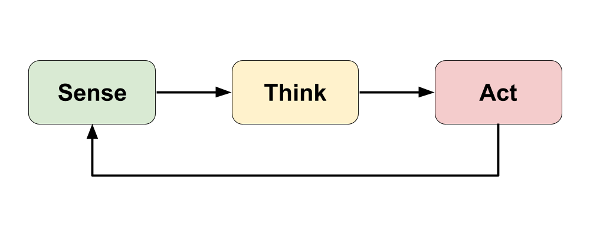

# 1.1 Robotics Research


**UPDATE IN PROGRESS:** This assignment will be updated.




You'll conduct background research to:

* better understand what a robot is
* become familiar with examples of different types of robots.

## What is a Robot?

1. Think about how you might define a "robot" in your own words:  What is a robot? How would you decide whether something was a robot or not? Briefly discuss and compare your ideas with other students.
2. Use these resources to learn more about robots:
   * **WATCH:**  [So, What is a Robot Really?](https://video.wired.com/watch/hardwired-so-what-is-a-robot-really) \(4 minutes to watch\)
   * **READ:**  [What is a Robot?](https://robots.ieee.org/learn/) \(7 minutes to read\)
   * **WATCH:**  [A Brief History of Our Robotic Future](https://www.youtube.com/watch?v=nlrr5b1XWoY) \(6 minutes to watch\)
3. Answer the following questions based on what you watched and read:
   * What is the “Sense-Think-Act” cycle, and how is it useful for understanding robots?
   * Why would a remote-controlled drone **not** be considered a robot?
   * How are robots and artificial intelligence \(AI\) related, and how are they distinct?
   * What are some possible benefits and risks associated with increased use of robots to automate tasks?

## **Examples of Robots**

1. Read this article that categorizes [different types of robots](https://robots.ieee.org/learn/types-of-robots/).
2. Conduct internet research to find a specific example for **three** different types of robots. Gather information to summarize the following for each robot example:
   * What is the robot's **name**, and what **type of robot** is it \(e.g., consumer, industrial, etc.\)? Be sure to include an image of the robot.
   * What is the robot's **purpose** and its specific **context of use** \(e.g., where is it used, etc.\)?
   * What **benefit or value** does the robot provide? \(e.g., is it more convenient, is it more efficient or accurate, is it safer, does it perform a task not possible otherwise, etc.\)
   * **SENSE:** What physical inputs \(such as: sensors, etc.\) does the robot have? What data does it gather from its physical environment using these inputs?
   * **THINK:** What kind of decisions can the robot make based on the data it gathers from its physical environment?
   * **ACT:** What physical outputs \(such as: motors, etc.\) does the robot have? What actions can it perform in its physical environment using these outputs?
   * What **information sources** were used in your research? \(include links to sources\)
3. Create a slide presentation to summarize your research findings for each robot example, and briefly present one or more of your examples to the class.

## **❏ Deliverable**

Submit the following:

* A document with your answers to the questions based on the robot videos and article
* A slide presentation with the research summary of your robot examples



TK



| **✓- Below Standard** | **✓ Meets Standard** | **✓+ Exceeds Standard** |
| :--- | :--- | :--- |
| Description | Description | Description |



