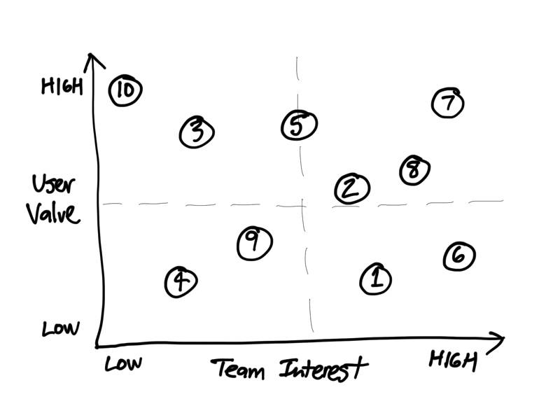

# 1.3 Project Ideas


**UPDATE IN PROGRESS:** This assignment will be updated.




Your team will generate possible ideas for a two-wheeled robot that performs useful tasks for people. After evaluating the ideas, your team will select one concept for your team’s project.


**RECOMMENDATION:** Focus on quantity of ideas before evaluating them for quality.


1. If necessary, review the [project challenge](../project-challenge.md), including the criteria and constraints.
2. Each team member should independently generate and record at least 10 possible ideas for a two-wheeled robot that could perform useful tasks. If helpful, create quick sketches to help illustrate ideas.
3. As a team, discuss and refine your ideas to form a combined **numbered list** of ideas for your robot prototype. For each idea, discuss these questions and make any refinements:
   1. What is the value or benefit of having a robot perform the task\(s\)?
   2. What are different tasks or behaviors that the robot prototype could demonstrate?
   3. Are there certain robot parts or actions that would need to be simulated? If so, can you still create a robot prototype that performs the main tasks?
4. Construct a [decision matrix](https://www.nngroup.com/articles/prioritization-matrices/) to help evaluate your team’s list of ideas by ranking the relative weight \(from Low to High\) of each robot idea on these two criteria \(and then plotting a **numbered point** on the matrix to represent each concept\):
   1. **User Value** \(how desirable and valuable would this product likely be to users\)
   2. **Team Interest** \(how much interest do you have in pursuing this as your project\)
5. Use the decision matrix to select one idea to pursue for your team’s project. Ideally, your selected idea will have high user value and high team interest.


**IDEA SPARKS:** Use this list of words to spark your initial idea generation:

* Warehouse, factory, landscaping, construction, shopping, hospitals, wheelchairs, retirement homes, kitchens, parking lots/garages, offices, parks, streets, sporting fields/courts, fitness, outdoor games, restaurants, fire and rescue, theme parks, planet or terrain exploration ...


## **❏ Deliverable**

Submit each team member’s initial list of ideas, your team’s combined numbered list of ideas, your team’s decision matrix, and identify which idea was selected for your team's project.







| **✓- Below Standard** | **✓ Meets Standard** | **✓+ Exceeds Standard** |
| :--- | :--- | :--- |
| Ideation is limited:  ideas presented are insufficient in quantity, lacking in diversity or creativity, and/or infeasible to address given the project constraints. | Robust set of diverse, feasible ideas are presented and considered. Idea selected for project has high user value and high team interest. | Ideas demonstrate especially keen or creative insight, recognizing unique problems that the team could address with an IoT solution. |



