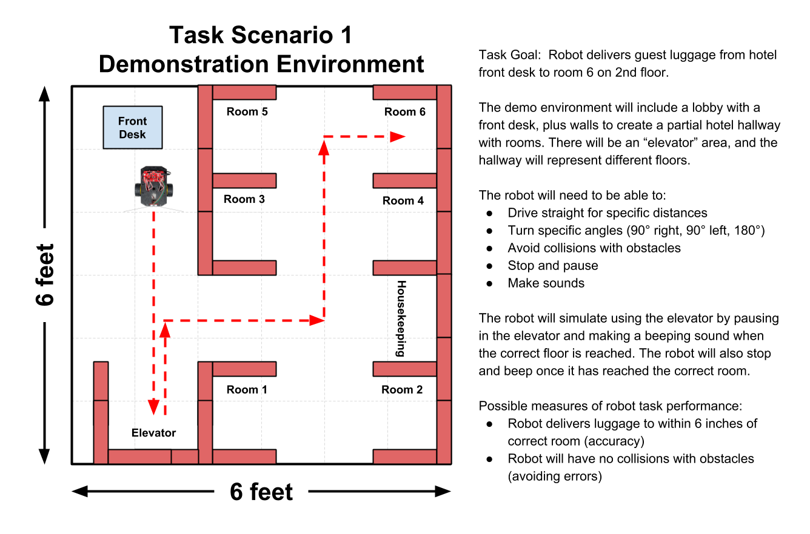

# 1.7 Robot Task Scenarios



Your team will diagram and describe 3 task scenarios that your robot prototype could demonstrate. These tasks could represent:

* different tasks that the robot will complete
* variations of the same task to show the robot's flexibility \(such as:  traveling to different destinations, avoiding obstacles even if their location changes, etc.\).

For example, imagine that your team is designing a hotel robot that transports luggage for the hotel guests. The first task might be for the robot to deliver luggage to a guest's room by navigating from the lobby through the hotel hallways to a specific guest room. The second task might be for the robot to navigate safely back to the lobby. The third task might be to deliver another set of luggage to a different guest room.

In the second phase of the project, your team will program its robot to perform its tasks within a demonstration environment \(6 feet by 6 feet\) that you'll construct. You'll create and place objects and other features in the demo environment to create a model that represents a real-world environment. \(If necessary for your robot demonstration, your team could rearrange certain objects during or between tasks to represent changes in the environment.\)

1. **Discuss and decide on 3 task scenarios that your team's robot prototype could demonstrate.** It might be helpful to create simple sketches of the robot demo environment \(top-down view of square environment\) to show possible objects and features, as well as the robot's possible path and actions as it completes the task. Later in this assignment, you'll create digital diagrams of each task scenario.
2. **Write a brief description of each task scenario.** Be sure to include:
   * the robot's overall goal for the task scenario
   * a description of the robot demo environment \(e.g., its objects and other features\)
   * a list of the key steps or behaviors that the robot will need to perform in order to complete the task — keep in mind that you can simulate certain steps or behaviors as long your robot can meaningfully demonstrate the main task \(be sure to identify if a specific step or behavior will be simulated\)
   * at least one possible method to measure or evaluate the robot's performance during the task — such as:
     * **accuracy** \(e.g., robot will stop within 6 inches of its intended destination, etc.\)
     * **efficiency** \(e.g., robot will complete the task within 20 seconds, etc.\)
     * **avoiding errors** \(e.g., robot will have no more than 1 collision, etc.\)
3. **Create a diagram for each task scenario.** The diagram should be a top-down view of the robot demo environment \(which will be 6 feet by 6 feet square\). The objects and other features in the environment should be drawn to approximate scale size relative to each other. Be sure the diagram is easy to understand.
   * You can use this Google Drawing template for each [Robot Task Scenario Diagram](https://drive.google.com/open?id=1fqNABZjAmwUlYZkKo7XfT7m5DdAr7oB_JXSz5JRYq8U) \(the robot is a separate object layer that can be moved and rotated as needed\). **REMINDER:** To use the template, select "Make a copy" from the File menu, and save it to your shared team folder in Google Drive.
   * Use shapes \(rectangles, circles, lines, etc.\) to draw **simple** representations of objects and other features that will be included in the environment \(such as:  walls, obstacles, people, surface lines, etc.\). Add text labels to identify key objects or features.
   * Show the robot at its starting position for the task, and use dashed arrows to draw the robot's path as it performs the task. Add text labels to identify key steps or behaviors along the robot's path.


**CLEAR THE WAY:**  The robot needs a path that is about 18" \(1.5 feet\) wide in order to drive forward and make turns. If you place walls and other obstacles too close together in the environment, your robot might not be able to navigate through them.


## **❏ Deliverable**

Submit your team's descriptions and diagrams of its 3 robot task scenarios







| **✓- Below Standard** | **✓ Meets Standard** | **✓+ Exceeds Standard** |
| :--- | :--- | :--- |
| description | description | description |



