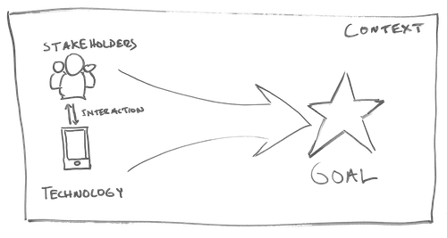

# 1 Discover & Define Problem

Begin to frame the goals of your design by learning about your users and other stakeholders, the available technology, and the current practices to reach similar goals. Practice using the technology, in order to better understand its possibilities and constraints for design purposes. Consider various problems to solve. Evaluate and refine your ideas for a problem to solve through internal review and stakeholder feedback, in order to select a specific concept to target. Define the specific stakeholders, technology, and goals for a potential solution to your targeted problem.

| Task | Estimated Time | ✓ | ✓+ |
| :--- | :--- | :--- | :--- |
| [1.1 Robotics Research](1.1-robotics-research.md) | 5 hours |  |  |
| [1.2 Robotics Code Tutorials](1.2-robotics-code-tutorials.md) | 10 hours |  |  |
| [1.3 Project Ideas](1.3-project-ideas.md) | 3 hours |  |  |
| [1.4 Competitive Analysis](1.4-competitive-analysis.md) | 2 hours |  |  |
| [1.5 User Research](1.5-user-research.md) | 4 hours |  |  |
| [1.6 Value Proposition](1.6-value-proposition.md) | 1 hour |  |  |
| [1.7 Robot Task Scenarios](1.7-robot-task-scenarios.md) | 2 hours |  |  |
| \*\*\*\*[**1.8 Proposal Presentation**](1.8-proposal-presentation.md)\*\*\*\* | 3 hours |  |  |

