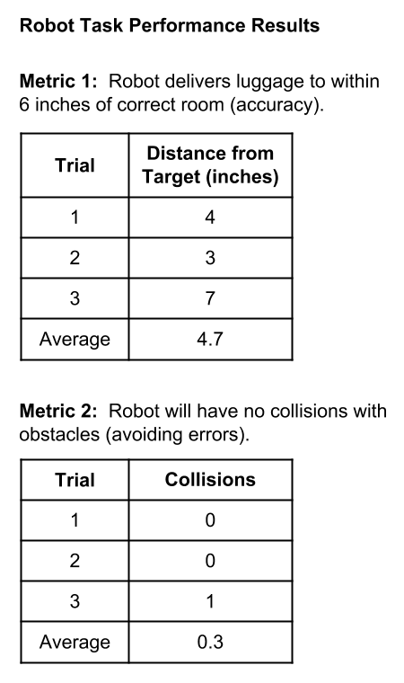

# 2.5 Robot Prototype



You'll program an app to make your robot demonstrate its task scenarios. You'll test your robot app \(and the robot's task performance\) using your team's robot demo environment.


**ONE APP TO RULE THEM ALL:** You'll program **one** app that contains all the code to demonstrate each of your task scenarios. You'll be able to use the robot's D12 button to control when each task is performed.


1. **Use your robot specifications and task scenario diagrams to create** **pseudocode for each task.** The pseudocode should logically describe the specific steps \(in order\) that the robot will have to perform for each task. Pseudocode is usually written in "plain language" – but it can also include "code-like" language \(such as `if` statements, etc.\).
   * Certain steps can be **simulated** as long your robot can perform the main actions of the task. For example, a team member could act as a "robotic arm" to pick up objects, as long as your robot performs the other necessary actions of the task \(e.g., transporting the object to a new location, etc.\).
2. **Use your robot specifications and pseudocode to determine what custom functions will be needed in your app to allow your robot to navigate its environment and perform other behaviors.**
   * For example, if your robot will navigate by following a line while counting other line markers it crosses, your app will need the `followCountLine()` function, as well as the `followLine()`, `driveDistance()`, and `pivotAngle()` functions.
   * You can also create your own custom functions. This is especially helpful if the same set of actions will be repeated multiple times within your app.
3. **Code your app in stages, and use your team's demo environment to periodically test and verify that your robot does what you expect.**
   * Start with this [robot demo app template](https://docs.idew.org/code-robotics/references/arduino-code-editor/robot-demo-app-template), and add the necessary code to customize it to demonstrate your team's task scenarios.
   * You'll most likely find it necessary to modify your robot's app code and/or your demo environment, in order for the robot to successfully perform its behaviors and complete its tasks.
4. **Use the metric\(s\) described in your robot specifications to measure or evaluate your robot's task performance \(accuracy, efficiency, avoiding errors, etc.\).**
   * Each task scenario should be evaluated with at least one task performance metric. If applicable, you can use the same metric for multiple tasks.
   * If necessary, you might be able to modify your app code and/or demo environment to improve your robot's task performance.
   * Once you are satisfied with the robot's performance \(or can't improve it further\), perform 3-5 final trials as a benchmark test of the robot's performance, and create a table to report the results for each trial, as well as the average result\(s\) across the trials.
5. **OPTIONAL:**  If applicable, you can construct and attach parts to your robot that will help it better demonstrate your robot concept and task scenarios. For example, if your robot is designed to transport objects, you could add a platform or basket to hold objects.
   * The parts should provide **functional value** by helping the robot perform its tasks and/or **aesthetic value** by adding to the robot's appearance.
   * Be sure the added parts **don't** interfere with your robot’s functionality \(e.g., don’t block sensors the robot needs to use, don’t add too much weight and reduce the robot's mobility, etc.\).
   * Take a photo showing the constructed parts attached to your robot. Use an image editor \(Google Drawing, etc.\) to annotate the photo with text labels that explain the purpose of the constructed parts.

## **❏ Deliverable**

Submit the following:

* Pseudocode for each task scenario
* Arduino code \(`.ino` file\) for the completed robot app
* Table with robot task performance results
* **If applicable:**  Annotated photo showing constructed parts added to robot



### Pseudocode for a Task

This pseudocode example is based on the example task scenario diagram included in assignment [1.7 Robot Task Scenarios](../1-discover-and-define-problem/1.7-robot-task-scenarios.md). The pseudocode uses plain language to describe the specific steps in order that the robot needs to perform to correctly complete the task.

### Converting Pseudocode into Code

This shows how the example pseudocode above could be converted into actual Arduino code to perform the task scenario. The code uses the `driveDistance()` and `pivotAngle()` custom functions for many of the task steps. Notice that the explanations in the pseudocode were converted into code comments to make it easier to understand \(and modify\) the code.

### Robot Task Performance Results

These example results use the task performance metrics listed in the example task scenario diagram included in assignment [1.7 Robot Task Scenarios](../1-discover-and-define-problem/1.7-robot-task-scenarios.md). For each metric, conduct 3-5 trials and calculate the average performance.




| **✓- Below Standard** | **✓ Meets Standard** | **✓+ Exceeds Standard** |
| :--- | :--- | :--- |
| Description | Description | Description |



