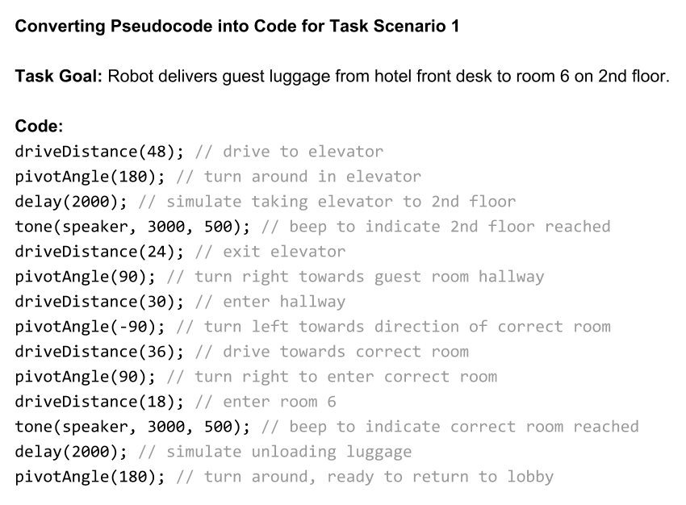

# 2.5 Robot Prototype


**UPDATE IN PROGRESS:** This assignment is being updated.


You'll program an app to make your robot demonstrate its task scenarios. You'll test your robot app \(and the robot's task performance\) using your team's robot demo environment.


**ONE APP TO RULE THEM ALL:** You'll program **one** app that contains all the code to demonstrate each of your task scenarios. You'll be able to use the robot's D12 button to control when each task is performed.


1. **Use your robot specifications and task scenario diagrams to create** **pseudocode for each task.** The pseudocode should logically describe the specific steps \(in order\) that the robot will have to perform for each task. Pseudocode is usually written in "plain language" – but it can also include some "code-like" language \(such as `if` statements, etc.\).
   * **Reminder:** Certain steps can be **simulated** as long your robot can perform the main actions of the task. For example, a team member could act as a "robotic arm" to pick up objects, as long as your robot performs the other necessary actions \(e.g., transporting the object to a new location, etc.\).
2. **Use your robot specifications and pseudocode to determine what custom functions will be needed in your app for your robot to navigate its environment and perform other behaviors.**
   * For example, if your robot will navigate by counting line markers it crosses as it follows a line, then your app will need the `followCountLine()` custom function, plus the `followLine()`, `driveDistance()`, and `pivotAngle()` functions.
   * You can also create your own custom functions to perform actions. This is especially helpful if the same actions will be repeated multiple times within your app code.
3. **Code your program in steps, and use your team's testing environment to periodically test and verify your program.** Your team will most likely find it necessary to modify your robot's program and/or your testing environment, in order for the robot to successfully complete its tasks and perform its behaviors.
   * It is recommended to code your program so your robot will demonstrate different tasks or scenarios in response to button inputs. This will give your team more control over the pace and sequence of the demonstration. \(The example programs show a way to accomplish this.\)
   * It may be helpful to have your robot produce distinct sounds as feedback when certain events or conditions occur in your demonstration.
   * Any custom functions that your robot app will use should be added to your code after the `loop()` function.
   * **Some of these custom functions require you to add missing code.** For example, the `checkBumpers()` function can detect collisions but needs code added perform specific actions when a collision occurs.
   * **Some of these custom functions may require you to adjust the values of certain local variables.** For example, the `followLine()` function has a local variable named `lineThreshold` whose value may need to be tested and adjusted.
   * **Some of these custom functions can be modified to better match the specific behaviors you need for your robot demonstration.** For example, the `avoidCollision()` function can be modified to better match the behavior your robot needs to perform in your task scenarios.
4. Measure or evaluate your robot's task performance \(such as:  accuracy, efficiency, avoiding errors, etc.\) using the methods defined in your team's robot specifications.
5. **OPTIONAL:**  If necessary, you can construct and attach parts to your robot that will help it better demonstrate your robot concept and task scenarios.
   * These parts should provide **functional value** by helping the robot perform its tasks and/or **aesthetic value** by adding to the appearance of the robot for demonstration purposes.
   * Be sure the parts don't interfere with your robot’s functionality \(e.g., don’t block sensors that your robot needs to use, don’t add too much weight that your robot's mobility is affected, etc.\).
   * Take a photo showing the constructed parts attached to your robot. Use an image editor \(Google Drawing, etc.\) to annotate the photo with text labels to identify the constructed parts and explain their purpose.

## **❏ Deliverable**

Submit the following:

* Pseudocode for each task scenario
* Arduino code \(`.ino` file\) for the completed robot app
* Robot task performance results
* **If applicable:**  Annotated photo showing constructed parts added to robot

### Pseudocode for a Task

This pseudocode example is based on the example task scenario diagram included in assignment [1.7 Robot Task Scenarios](../1-discover-and-define-problem/1.7-robot-task-scenarios.md). The pseudocode uses plain language to describe the specific steps in order that the robot needs to perform to correctly complete the task.

### Converting Pseudocode into Code

This shows how the example pseudocode above could be converted into actual Arduino code to perform the task scenario. The code uses the `driveDistance()` and `pivotAngle()` custom functions for many of the task steps. Notice that the explanations in the pseudocode were converted into code comments to make it easier to understand \(and modify\) the code.

| **✓- Below Standard** | **✓ Meets Standard** | **✓+ Exceeds Standard** |
| :--- | :--- | :--- |
| Description | Description | Description |

