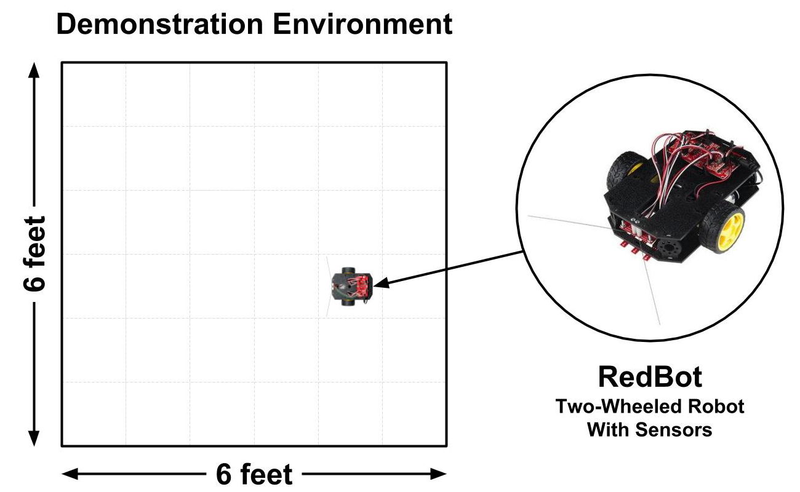

# Project Challenge



Each team must design and develop a prototype of a **two-wheeled robot** that demonstrates the completion of useful tasks for people within a specific context \(home, school, business, etc.\).

Your **robot demonstration environment** will be limited to 6 feet by 6 feet in size. Your team will customize this area to model a real-world environment by adding obstacles, objects, etc.

Your team will create a functional prototype of your robot using the provided robotics kit, which has various physical inputs \(sensors, etc.\) and physical outputs \(motors, etc.\) that can be programmed to perform various actions and behaviors.

* **Creative thinking will be required** to identify possible tasks that the robot could demonstrate by sequencing different robot behaviors and actions. Every team will have an identical robotics kit, but each team will need to generate their own innovative concept for a robot that performs useful tasks.
* Your robot prototype and demonstration environment may have to be a **smaller-scale model or limited version** of the real thing. For example, your demo environment will most likely represent a scaled-down, limited model of the real environment in which the robot would function. Furthermore, your robot prototype might not be capable of performing all the actions of your intended robot design.
* If necessary, **you can simulate certain robot parts or actions** as long as the main tasks of your robot can still be demonstrated. For example, the robotics kit does **not** include an arm to grip objects. However, your team could simulate a robotic arm grabbing or placing an object, as long as the robot could still demonstrate another main task \(such as navigating the environment to transport the object to a new location\).
* If necessary, **you can construct parts** \(using cardboard, 3D-printing, etc.\). These parts could provide _functional value_ by helping the robot perform its tasks and/or _aesthetic value_ by adding to the appearance of the robot \(or environment\) for demonstration purposes.

### Website, Video, Poster, and Public Presentation

Each team will also create a **product website** to explain and market their robot concept. The website will include a **robot demo video** showing the robot prototype completing its tasks.

At the end of the semester, all teams will demonstrate and explain their robot prototypes at a **public poster presentation**.



Each phase of the project has a set of interim deliverables, but they lead to these final deliverables from each team:

* **Robot Prototype and Demo Environment** that demonstrate your robot completing its tasks
* **Product Website and Robot Demo Video** that explain and show your robot solution
* **Project Poster** that highlights key features of your robot and key steps in creating it
* **Public Presentation** that demonstrates your robot solution and explains how it was created



Each team's robot prototype solution must meet these design criteria:

* **Innovative:** your solution should be unique \(or an improvement over existing solutions\)
* **Feasible:** your solution should be possible to prototype with the given materials/resources
* **Useful:** your solution should fulfill a need, solve a problem, or improve an existing situation
* **Usable:** your solution should be easy to understand and efficient to use
* **Valuable:** your solution should be desirable and valuable to users/stakeholders



Each team's robot prototype and demonstration environment is subject to these constraints:

* Robot prototype must demonstrate tasks that **require wheeled movement**. Otherwise, if the tasks don't require movement, they could be completed by a non-robotic device.
* Robot prototype must use at least **two different physical inputs** \(sensors, button, etc.\) and at least **two different physical outputs** \(motors, LED light, etc.\) included in the robotics kit.
* Robot prototype and demo environment may have to be a **smaller-scale model or limited version** of the real thing \(as long as the main tasks of the robot can still be demonstrated\). 
* Robot prototype can **simulate certain parts or actions** \(as long as the main tasks of the robot can still be demonstrated\).
* Robot prototype and demo environment can include **constructed parts** \(e.g., cardboard, 3D-printed, etc.\) that provide functional value and/or aesthetic value.



Each team will have 2-4 members that serve in one or more of these roles:

* **Design Lead:**  leads research and evaluation of robot design and tasks
* **Development Lead:**  leads programming of robot behaviors and tasks
* **Business Lead:**  leads product analysis and marketing of robot concept
* **Project Manager:**  leads team to ensure project completed successfully

**Teams of 2** need to designate one person as the Design Lead and the other person as the Development Lead. The Design Lead will also serve as the Business Lead, while the Development Lead will also serve as the Project Manager.

**Teams of 3** need to designate different people as the Design Lead, the Development Lead, and the Business Lead. One person will also need to serve as the Project Manager.

**Teams of 4** need to designate different people for each role.

It is highly recommended that each team agree to a set of team rules at the beginning of the project. Here is a possible [project team agreement](https://drive.google.com/open?id=11OySnAbGoev728UWsiaUk818CputNZFJ291MJNwkRwc) that could be used.



