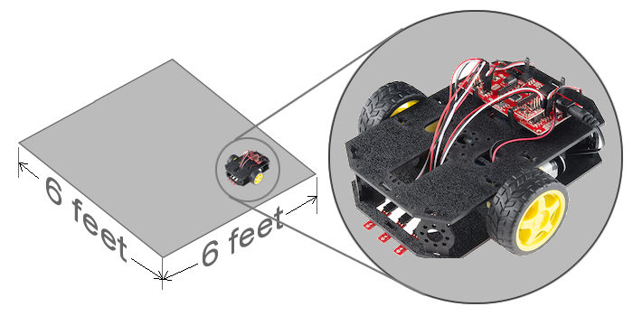

# Project Challenge

Design, program, and test a [two-wheeled robot](https://www.sparkfun.com/products/12649) prototype that demonstrates the completion of  meaningful tasks for people.

**The Robot and Prototype Environment Scale**

## Project Stages

#### [1. Discover and Define a Problem](1-discover-and-define-problem/)

Research potential problems, stakeholders, the available technology, and features of existing robotics designs. You may focus on a personal context \(home, recreation, etc.\), business context \(office, industry, etc.\), or public context \(school, police, etc.\). Determine your problem focus and thoughtfully define how you will evaluate your final prototype.

**Stage Deliverable: Present Team Proposal to Class**

#### [2. Design and Build \(Program\) a Solution](https://github.com/cxd/robotics-project/tree/fbb39c73504934f9ec46bf26d114575f1e749e00/3-prototype-and-evaluation.md)

Program a functioning prototype that represents a scale model of the final product \(which might be larger or smaller\), including the testing environment. Your prototype might not have all the sensors or other parts that your solution design envisions. However, your prototype should still serve as a viable “proof of concept” to demonstrate and evaluate your solution design. Develop a draft of your poster/marketing material as well.

**Stage Deliverables: Demonstrate a Working Prototype and Present Marketing Material to Class**

#### [3. Evaluate and Improve the Solution](https://github.com/cxd/robotics-project/tree/fbb39c73504934f9ec46bf26d114575f1e749e00/5-launch-tracking-and-feedback.md)

Rigorously evaluate your prototype and perform several design iterations to improve the performance of your solution. Evaluate and finalize the marketing material as well by getting feedback from people outside of class.

**Stage Deliverables: Demonstrate Final Prototype and Poster Material to Class**

#### [4. Share Project with Public](https://github.com/cxd/robotics-project/tree/fbb39c73504934f9ec46bf26d114575f1e749e00/6-reflection-and-presentation.md)

Take this time to reflect on your project and the outcomes. Develop a thoughtful narrative to share with others.

**Stage Deliverables: Public Presentation and Personal Reflection Document**

## Teams

Teams of 3 students will collaborate to build a _high-quality_ robotics prototype.

**Each team will be responsible for** _**\(1\) determining member roles, \(2\) maintaining good communication, \(3\) ensuring equitable contributions, and \(4\) providing clear project updates to the class in a timely manner.**_

Below are the recommended team member roles that you may need to adapt for the number of people in your team.

* **Product Manager**:  acts as lead for managing team developing product
* **Programming Lead**:  acts as lead for building and programming device
* **Research Lead**:  acts as lead for user research and evaluation
* **Marketing Lead**:  acts as lead for marketing of product concept

## Final Deliverables

1. **Prototype of Robot and Testing Environment \(maximum of 6' x 6'\)**  that is ready to demonstrate and evaluate
2. **3' x 2' Poster** that highlights key features of solution and key steps in creating it
3. **3" x 5" Marketing image** to represent your team in the promotional material for the presentation event.
4. **Presentation** to show your solution and explain how it was designed, built, and tested

## Criteria

* **Innovative:**  solution should be unique \(or be improvement over existing solutions\)
* **Feasible:**  solution should be possible to prototype \(and to become real product\)
* **Useful:**  solution should fulfill a need, solve a problem, or improve existing situation
* **Usable:**  solution should be easy and efficient to use
* **Valuable:**  solution should be desirable and valuable to potential users

## Recommended Tools

* [Google Drive](https://drive.google.com) - for team file management and Docs, Sheets, Slides, and Drawings.
* If Needed, [Redbot Assembly Instructions](https://learn.sparkfun.com/tutorials/assembly-guide-for-redbot-with-shadow-chassis)

## Rubrics

Rubrics for each stage are provided, along with personal contribution and teamwork rubrics. Below are the basic levels of evaluation that will be used for most rubric items.

| ✕ | ✓- | ✓ | ✓+ |
| :--- | :--- | :--- | :--- |
| No reasonable effort made. | A reasonable effort was made, but components of the core expectations were not sufficiently met. | The core expectations of the assignment were sufficiently met, but little advanced work was delivered. | The core expectations were met along with compelling advanced work. |

#### **Ultimately your work will be assessed by many people during the final presentation. So teams should carefully consider the perspective of visitors that may have no prior knowledge of your project.**

