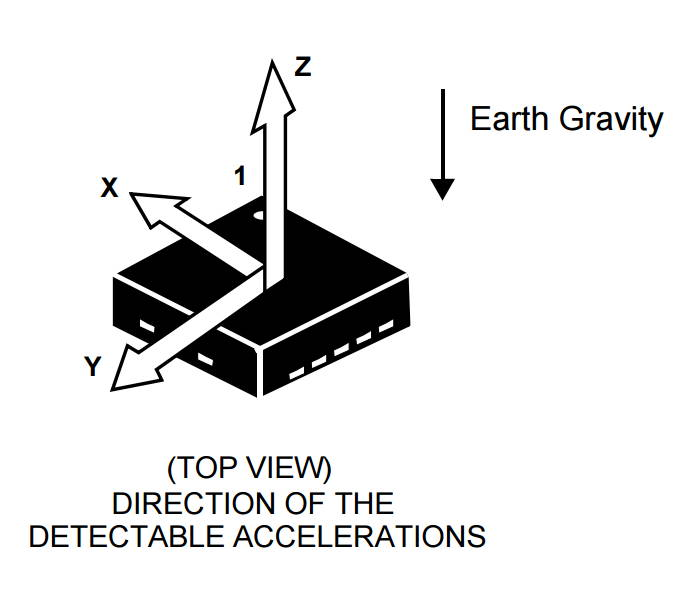

# Accelerometer

The RedBot has an accelerometer can be measure changes in motion or orientation in 3 dimensions \(X, Y, Z\). Accelerometers are used in a variety of devices, including smartphones, fitness trackers, etc.

Accelerometer readings are affected by:

* acceleration of the device \(i.e., the device speeding up or slowing down\)
* acceleration due to Earth's gravity \(i.e., the orientation of the device\)



Even if a device with an accelerometer is **not** moving, the accelerometer can detect the orientation of the device by measuring the acceleration due to Earth's gravity, which is a constant downward force acting on all objects. The accelerometer can determine if the device is parallel to the Earth's surface or if it is tilted at an angle.

For example, smartphones have accelerometers that detect the device's orientation in order to change the screen view to match the phone orientation \(e.g., changing from portrait view to landscape view, etc.\).

### How to Use the Accelerometer in a Program:

To use the accelerometer, you will need to: 1. Create `RedBotAccel` object 2. Use the object's `read()` method to get measurements 3. Add code to perform an action based on the accelerometer measurements

### Coding References in this Section:

* Create RedBotAccel Object
* Check Accelerometer Measurements
* Use Serial Monitor to View Accelerometer Measurements
* Detect Tip Over
* Detect Bump

## Create RedBotAccel Object

The SparkFun `RedBot` library has a class named `RedBotAccel` which contains methods \(functions\) to control the accelerometer.

**IMPORTANT:** Be sure that your program includes a copy of the SparkFun `RedBot` library. If necessary, see the instructions for [how to include the RedBot library](redbot-library.md).

Before your `setup()` function, create a `RedBotAccel` object by assigning it to a variable:

```cpp
RedBotAccel accel;
```

* `RedBotAccel` indicates the class of object being created \(this class is part of the `RedBot` library\)
* `accel` represents the variable name for the `RedBotAccel` object. If desired, you could use a different variable name.

## Check Accelerometer Measurements

To check the measurements from the accelerometer, use the `RedBotAccel` object's `read()` method to get new measurements for each of the 3 axes \(X, Y, Z\):

```cpp
accel.read();
```

The new measurements are stored as properties of the object:

* `accel.x` — acceleration along X axis
* `accel.y` — acceleration along Y axis
* `accel.z` — acceleration along Z axis
* `accel.angleXZ` — device's angle in XZ plane \(pitch\)
* `accel.angleYZ` — device's angle in YZ plane \(roll\)
* `accel.angleXY` — device's angle in XY plane \(yaw\)

This diagram shows how the X, Y, and Z axes are oriented on your RedBot and what the XZ, YZ, and XY angles represent. These angles are also referred to as **pitch**, **roll**, and **yaw**.


For a wheeled vehicle, pitch and roll are the most important angles to measure as they indicate the tilt of the vehicle from front-to-back and side-to-side.

### Pitch

Angle XZ represents **pitch**. Pitch is the front-to-back rotation on the device's Y axis. Pitch \(angle XZ\) can range from -180° to 180°.

* If the RedBot is perfectly level from front-to-back, the pitch is zero \(angle XZ = 0\).
* If the front of the RedBot is rotated up, the pitch is a positive value \(angle XZ &gt; 0\). For example, if the front of the RedBot were pointing straight up, the pitch would be 90°.
* If the front of the RedBot is rotated down, the pitch is a negative value \(angle XZ &lt; 0\). For example, if the front of the RedBot were pointing straight down, the pitch would be -90°.

### Roll

Angle YZ represents **roll**. Roll is the side-to-side rotation on the device's X axis. Roll \(angle YZ\) can range from -180° to 180°.

* If the RedBot is perfectly level from side-to-side, the roll is zero \(angle YZ = 0\).
* If the left side of the RedBot is rotated up, the roll is a positive value \(angle YZ &gt; 0\). For example, if the left side of the RedBot were pointing straight up, the roll would be 90°.
* If the left side of the RedBot is rotated down, the roll is a negative value \(angle XZ &lt; 0\). For example, if the left side of the RedBot were pointing straight down, the roll would be -90°.

### Yaw

Angle XY represents **yaw**. Yaw is the right-to-left rotation on the device's Z axis. Yaw \(angle XY\) can range from -180° to 180°.

However, when the RedBot is sitting on a level surface, the yaw value **cannot** be accurately determined because the acceleration due to Earth's gravity is acting in the same direction \(i.e., downward\) as the Z axis.

### How can the values for pitch and roll be useful?

If your RedBot is traveling over an uneven surface, then the values for pitch and roll will vary based on the slope of the surface.

The values for pitch and roll could help identify when the RedBot is moving up a slope \(pitch &gt; 0°\), down a slope \(pitch &lt; 0°\), or along the side of a slope \(roll ≠ 0°\). This might be helpful for adjusting the motor power \(e.g., more power might be needed to travel uphill, etc.\).

In fact, you could possibly use the pitch and roll angles from the RedBot's accelerometer to "map" the shape of the surface.

If the RedBot were to tip over for some reason, then the values for pitch and/or roll would be higher than 90°. If the RedBot were completely upside down, the values for both would be close to 180°. If the Redbot were to tip over, it might be best to stop the motors and use the buzzer to produce a "distress" signal.

## Use Serial Monitor to View Accelerometer Measurements

To test out your accelerometer, you can view the accelerometer measurements using the serial monitor in the Arduino code editor.

### 1. Start Serial Connection

Add this code into your `setup()` function to start a serial connection between your RedBot and the code editor:

```cpp
// start serial connection to view sensor data
Serial.begin(9600);
```

### 2. Send Data Over Serial Connection

Add this custom function named `testAccelerometer()` after your `loop()` function. This custom function will send \(print\) the accelerometer measurements over the serial connection:

### testAccelerometer\(\) function

```cpp
void testAccelerometer() {

    accel.read(); // get new accelerometer data

    // raw measurements for X, Y, and Z axes
    Serial.print("X: ");
    Serial.println(accel.x);
    Serial.print("Y: ");
    Serial.println(accel.y);
    Serial.print("Z: ");
    Serial.println(accel.z);

    // angles for X-Z (pitch), Y-Z (roll), and X-Y (yaw)
    Serial.print("Angle XZ (pitch): ");
    Serial.println(accel.angleXZ);
    Serial.print("Angle YZ (roll): ");
    Serial.println(accel.angleYZ);
    Serial.print("Angle XY (yaw): ");
    Serial.println(accel.angleXY);
    Serial.println();

    delay(250); // make it easier to read data  
}
```

Then be sure to call this custom function in your `loop()` function:

```cpp
void loop() {
    testAccelerometer();
}
```

**NOTE:** Be sure that your program also contains the necessary code to create a `RedBotAccel` object named `accel`.

### 3. View Data in Serial Monitor

After uploading the program to the RedBot, **keep the RedBot connected to your computer using the USB cable** \(because the serial data is transferred over USB\).

Open the Serial Monitor window in your Arduino code editor:

* **Arduino Create Web Editor**: Click the "Monitor" menu in the left navigation panel.
* **Arduino IDE Desktop Editor:** Under the "Tools" menu, select "Serial Monitor".

It may take a few seconds for the serial connection to be detected by the editor. Then you should see the accelerometer measurements being displayed in the serial monitor window.

Try the following tests to see how the accelerometer measurements change:

* Place the RedBot's wheels on a level surface, such as a table. If the RedBot is perfectly level, the measurements for both pitch and roll should be close to 0°. Even if the measurements are negative, they should be relatively close to zero.
* Pick up the RedBot, and slowly tilt its front end upward. See how the values for **pitch** \(angle XZ\) change as you increase the upward tilt. Stand the RedBot on its back end, so its front end is pointing straight up. The pitch should be close to 90°. Pick the RedBot up again, and slowly tilt its front end downward. See how the values for pitch change as you increase the downward tilt. When the front end is pointing straight down, the pitch should be close to -90°.
* Pick up the RedBot, and slowly tilt it sideways to the right. See how the values for **roll** \(angle YZ\) change as you increase the tilt. When the right side of the RedBot is pointing straight down, the roll should be close to 90°. Then see how the values for roll change as you tilt it sideways to the left. When the left side of the RedBot is pointing straight down, the roll should be close to -90°.
* See what happens to the values for pitch and roll when the RedBot is tilted upside down.

## Detect Tip Over

You could use the accelerometer to detect when the RedBot is upside down due to being tipped over.

If the RedBot were to tip over for some reason, then the values for pitch and/or roll would be higher than 90°. If the RedBot were completely upside down, the values for both would be close to 180°.

If the Redbot is upside down, it might be helpful to stop the motors and use the buzzer to produce a "distress" signal.

For example, a custom function named `checkUpsideDown()` could be used to check whether or not the RedBot has tipped over:

```cpp
void loop() {

    boolean tippedOver = checkUpsideDown();

    if (tippedOver) {
        // add code to perform special actions: brake, distress signal, etc.
        motors.stop();

    }
    else {
        // add code to perform normal actions: drive, turn, etc.
        motors.drive(150);

    }
}
```

### checkUpsideDown\(\) function

Be sure to include the `checkUpsideDown()` function after your `loop()` function:

```cpp
boolean checkUpsideDown() {
    // returns value of true if RedBot upside-down
    // otherwise returns value of false

    accel.read(); // get new accelerometer data

    // get absolute values for pitch and roll
    float pitch = abs(accel.angleXZ);
    float roll = abs(accel.angleYZ);

    // see if pitch or roll is greater than 90 degrees
    if (pitch > 90 || roll > 90) return true;
    else return false;
}
```

You can test out this program by holding your RedBot in the air by its back end. When the RedBot is held in its "normal" level position, its wheels will drive forward. Once you've tilted the RedBot past 90° in any direction \(front end, back end, left side, or right side\), it should detect that it is "upside-down" and stop its motors.

## Detect Bump

The `RedBotAccel` object also has a method for using the accelerometer to detect a "bump" - i.e., to detect if the RedBot is physically hit. The bump could be the result of driving over a bump or a collision with an object.

Your program must first turn on the "bump" detection by using the `RedBotAccel` object's `enableBump()` method. Since you only need to do this once at the start of your program, add this code into your `setup()` function:

```cpp
accel.enableBump();
```

Then you can check for a "bump" using the `RedBotAccel` object's `checkBump()` method, which will return a value of `true` or `false` based on whether or not a bump was detected. You can assign the function's returned value to a local variable, and then perform an action if the variable is `true` \(or an alternate action if it is `false`\).

For example, you could check for a "bump" in your `loop()` function:

```cpp
void loop() {

    boolean bump = accel.checkBump();

    if (bump) {
        // add code to perform when bump detected
        tone(buzzer, 1000);
        delay(200);
        noTone(buzzer);
    }

    // add other code to perform
}
```

In the example code above, the RedBot's buzzer will be used to produce a sound when a bump is detected. You can test this with your RedBot: upload the program, and then tap on the RedBot's body to see if it detects the "bump" and makes a sound.

For example, if the RedBot were operating in an environment where it might be bumped by people, it might be helpful to detect these bumps and then alert people to the presence of the RedBot by making a sound.

