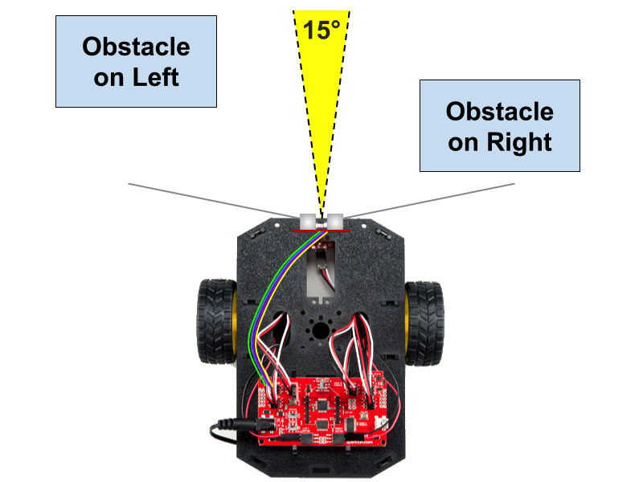
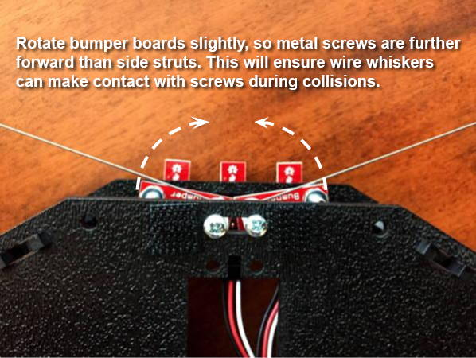

# Mechanical Bumpers

The RedBot has left and right mechanical bumpers that act like "whiskers" to detect collisions with obstacles. Each "whisker" is a flexible metal wire that will bend during a collision. If the wire bends far enough to touch a metal screw on the bumper board, it acts like an electrical switch allowing current to flow through the bumper's circuit board.

**NOTE:** If your RedBot also has an [ultrasonic sensor](https://cxd.gitbooks.io/robotics-project/content/redbot-code-references/ultrasonic-sensor.html) \(which can detect obstacles before a collision happens\), it may be best to think of the mechanical bumpers as a fallback system that supplements the ultrasonic sensor. The ultrasonic sensor detects obstacles in a narrow cone of about 15° directly in front of the sensor. However, the ultrasonic sensor might not necessarily detect obstacles off to the side. Since the mechanical bumper whiskers extend outwards on both sides, they can detect a collision with an obstacle that the ultrasonic sensor might not have detected, as shown below.



### How to Use the Mechanical Bumpers in a Program:

To use the mechanical bumpers, you will need to: 1. Create `RedBotBumper` objects for each mechanical bumper 2. Use each object's `read()` method to detect whether a collision has occurred 3. Add code to perform an action when a bumper collision is detected

### Assembly Instructions in this Section:

* Check Bumper Board Positions

### Coding References in this Section:

* Create RedBotBumper Objects
* Check Bumpers for Collision

## Check Bumper Board Positions

**NOTE:** The side struts at the front of the RedBot might prevent the bumper wires from making contact with the metal screws. To fix this, rotate the bumper boards slightly \(about 10°\) and secure them in place, so the metal screws are slightly further forward than the side struts. The left bumper board should be rotated clockwise, while the right bumper board should be rotated counter-clockwise. The picture shows the bumper boards already rotated \(about 10°\) into their final positions.



## Create RedBotBumper Objects

The SparkFun `RedBot` library has a class named `RedBotBumper` which contains methods \(functions\) to control the RedBot's mechanical bumpers.

**IMPORTANT:** Be sure that your program includes a copy of the SparkFun `RedBot` library. If necessary, see the instructions for [how to include the RedBot library](redbot-library.md).

Before your `setup()` function, create a `RedBotBumper` object for each mechanical bumper by assigning each to a variable and indicating its pin number:

```cpp
RedBotBumper leftBumper(3);
RedBotBumper rightBumper(11);
```

* `RedBotBumper` indicates the class of object being created \(this class is part of the `RedBot` library\)
* `leftBumper` represents a variable name for a `RedBotBumper` object, and `3` indicates the pin number this bumper is connected to. If desired, you could use a different variable name.
* `rightBumper` represents a variable name for a `RedBotBumper` object, and `11` indicates the pin number this bumper is connected to. If desired, you could use a different variable name.

## Check Bumpers for Collisions

To check the mechanical bumpers for collisions with obstacles, use the `RedBotBumper` object's `read()` method to detect whether or not each bumper has made contact:

* `leftBumper.read()`
* `rightBumper.read()`

If the method returns a value of `LOW`, it means the bumper has made contact. \(A value of `HIGH` means the bumper has not made contact.\)

The `leftBumper.read()` and `rightBumper.read()` methods can inserted within an if-else statement:

```cpp
if (leftBumper.read() == LOW) {
    // add code to perform for left bumper collision
    motors.brake();

}
else if (rightBumper.read() == LOW) {
    // add code to perform for right bumper collision
    motors.brake();

}
```

You will need to decide what code to perform if the left or right bumper collides with an obstacle. Most likely, the first thing that you should do is make the RedBot motors brake.

You could also make the RedBot produce a brief sound as feedback. This would be useful for testing your code by bending the whiskers to verify the sound is produced when the wire touches the metal screw. What type of sound \(frequency, duration, number of beeps, etc.\) would make the most sense for an "accident" event like a collision?

Finally, you will most likely need to make the RedBot get around the obstacle that it has collided with. For example, make the RedBot back away from the obstacle by driving backwards for a short distance. Then make the RedBot turn away from the obstacle before proceeding forward again. The direction that the RedBot turns should depend on which bumper made contact.

**NOTE:** If you used different variable names for your `RedBotBumper` objects, then change `leftBumper` and `rightBumper` to match the names of your variables. For example, if you used `rWhisker` as your object variable name for the right bumper, your code should use `rWhisker.read()` to check for a right bumper collision.

You can either insert this code into your `loop()` function or into a custom function that is called by your `loop()` function.

### checkBumpers\(\) function

For example, here is a custom named named `checkBumpers()` that checks for a collision with the left bumper, right bumper, or both bumpers:

```cpp
void checkBumpers() {

    int leftWhisker = leftBumper.read();
    int rightWhisker = rightBumper.read();

    if (leftWhisker == LOW && rightWhisker == HIGH) {
        // add code for when left whisker collides: brake, back up, turn right

    }
    else if (leftWhisker == HIGH && rightWhisker == LOW) {
        // add code for when right whisker collides: brake, back up, turn left

    }
    else if (leftWhisker == LOW && rightWhisker == LOW) {
        // add code for when both whiskers collide: brake, back up, turn around

    }
}
```

You'll need to add code within the custom function to perform actions \(brake, back up, turn, etc.\) for each of the possible bumper collisions \(left, right, or both\).

