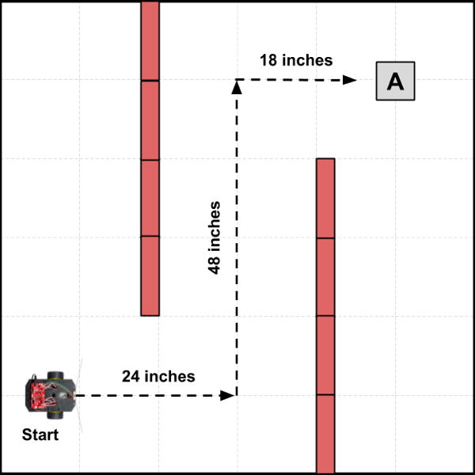

# Program Example 1 - Distance Nav

In this example program, the robot will navigate by driving straight for specific distances and making turns \(or stops\) at specific points. The program will need to contain code instructions that break down the navigation path into an ordered sequence of specific distances and turns \(i.e., pivot angles\).

This navigation method is similar to the detailed "turn-by-turn" directions that a mapping app generates to route a car to a specific destination \(such as "Continue for 2.9 miles, and then turn right. After 1.5 miles, turn left..."\).

## Example Scenario

The diagram below represents a scenario where a hospital robot will navigate through a hallway \(red rectangles are cardboard boxes that represent walls\) towards an nurse's station, simulate picking up blood samples \(team member would pick up box labeled as "A"\), and then transport the samples back to the hospital lab \(labeled as "Start"\).



For the purposes of the demonstration, the distances traveled are much shorter than what would be required in an actual hospital environment. Also, for the actual demonstration, it would be essential to place the robot and other objects at the exact starting positions shown in the diagram by using a tape measure to confirm the distances and positions.

## Example Program

Here is a possible way to code the program to demonstrate this particular scenario:

```cpp
/*
  Robot Demo - Example 1
  Drive in specific pattern using turn-by-turn distance navigation
*/

// SparkFun RedBot Library
#include <RedBot.h>

// create objects using classes in RedBot library
RedBotButton button;
RedBotMotors motors;
RedBotEncoder encoder(A2, 10);

// global variables for buzzer and LED pin numbers
const int buzzer = 9;
const int led = 13;

// global variables to keep track of which scenario to demonstrate
int scenario = 1;
boolean started = false;

void setup() {
  pinMode(buzzer, OUTPUT);
  pinMode(led, OUTPUT);
}

void loop() {
  checkButton();
  if (started == true) {
    if (scenario == 1) scenario1();
    else if (scenario == 2) scenario2();
    else if (scenario == 3) scenario3();
  }
}

void scenario1() {
  // Scenario 1: Drive through hallway to pick up object and deliver back to start

  // drive from Start to Object A
  driveDistance(24, 175); // drive 24 inches at motor power of 175
  pivotAngle(-90); // pivot -90 angle = turn left
  driveDistance(48, 175);
  pivotAngle(90); // pivot 90 angle = turn right
  driveDistance(18, 175);

  // Simulated Step - pause and pick up Object A
  alertSound();
  delay(3000); // wait 3 seconds for object to be picked up
  alertSound(); // make another alert before heading back

  // turn around and drive back to Start
  // use lower motor power (slower) because carrying object
  pivotAngle(180); // pivot 180 degrees = turn around
  driveDistance(18, 125);
  pivotAngle(-90);
  driveDistance(48, 125);
  pivotAngle(90);
  driveDistance(24, 125);

  // Simulated Step - Object A is placed down and delivered
  alertSound();

  // set global variables for 2nd scenario
  scenario = 2;
  started = false;
}

void scenario2() {
  // add code for Scenario 2

  // set global variables for 3rd scenario
  scenario = 3;
  started = false;
}

void scenario3() {
  // add code for Scenario 3

  // reset global variables for 1st scenario
  scenario = 1;
  started = false;
}

void checkButton() {
  // add code for this custom function
}

void alertSound() {
  // add code for this custom function
}

void driveDistance(float distance, int power) {
  // add code for this custom function
}

void pivotAngle(float angle) {
  // add code for this custom function
}
```

## How Program Works

Here's how the program code works:

1. The SparkFun RedBot Library file is included in the program, so you can utilize the built-in classes and methods \(functions\) in this library that allow you to control the robot's motors, sensors, and other parts.
2. Object variables for the push button, motors, and wheel encoders are created using classes contained in the RedBot library.
3. Global variables are declared and assigned for the buzzer and LED pin numbers, as well as to keep track of which scenario to demonstrate \(and whether the robot has been "started" by pushing its button\).
4. The `setup()` function sets the pin modes for the buzzer and the LED.
5. The `loop()` function contains the main tasks that the robot performs:
   * A custom function named `checkButton()` checks whether the robot's button has been pushed. If that happens, the function changes the value of the global variable named `started` to become `true`. The reason for waiting for a button push is to allow your team to control the pace of the demonstration. For example, if your team needs to rearrange certain objects or obstacles between scenarios, the robot will wait until you push the button before starting the next scenario.
   * Next an `if` statement checks whether the value of `started` is `true`. If so, then it runs a different custom function \(such as: `scenario1()`, etc.\) depending on the current value of the global variable named `scenario` \(which was initially set to a value of `1`\). This allows your different scenarios to be performed in order.
   * Remember that the `loop()` function repeats itself over and over. In this case, it will keep checking to see if the button was pushed and if so, running the custom function for the correct scenario number.
6. A custom function named `scenario1()` contains all the code instructions for the first scenario in the demonstration, which is the scenario shown in the diagram above. The code instructions primarily consists of "calls" to other custom functions that perform specific tasks:
   * `driveDistance()` is a custom function that drives the robot a specific distance \(measured in inches\) at a specific motor power
   * `pivotAngle()` is a custom function that pivots \(turns\) the robot by a specific angle \(measured in degrees\)
   * `alertSound()` is a custom function that produces a specific sound pattern using the buzzer. Sounds are a great way to provide feedback when specific events or conditions occur during the demo. Sounds make it clear that the robot is acting intentionally.
   * Note that at the very end of `scenario1()`, the values of the global variables for `scenario` and `started` are changed to be ready for the next scenario \(which will wait to start until you push the button again\).
7. Custom functions for `scenario2()` and `scenario3()` are listed, but they are empty at the moment. You would need to add the specific code instructions for these scenarios, similar to the `scenario1()` instructions.
   * For example, maybe for Scenario 2, your team would move Object A to a different location within the hallway to show that the robot can travel to different destinations within the hospital — or maybe you would place another object \(Object B\) at a different location in the hallway to show that the robot can make multiple stops to pick up objects before heading back.
   * Maybe for Scenario 3, your team would demonstrate that your robot can avoid colliding with people \(or other obstacles\) in the hallway while still finding its way to Object A.
8. The program utilizes several pre-built custom functions that are listed in other sections of this project guidebook. In order for this program to work properly, you would need to add the full code for the following custom functions:
   * `checkButton()` — code listed in [Push Button](push-button.md#checkbutton-function) section
   * `alertSound()` — code listed in [Buzzer \(Speaker\)](buzzer-speaker.md#alertsound-function) section
   * `driveDistance()` — code listed in [Wheel Encoders](wheel-encoders.md#drivedistance-function) section 
   * `pivotAngle()` — code listed in [Wheel Encoders](wheel-encoders.md#pivotangle-function) section

Although this program is only an example, you could use it as a template to create your own program. At a minimum, you would need to modify the code instructions listed inside the `scenario1()` custom function — and also add the missing code for the other custom functions.

If you wanted to add other features to your robot demonstration, such as avoiding collisions using an ultrasonic sensor, then you would need to add other code into the program.

