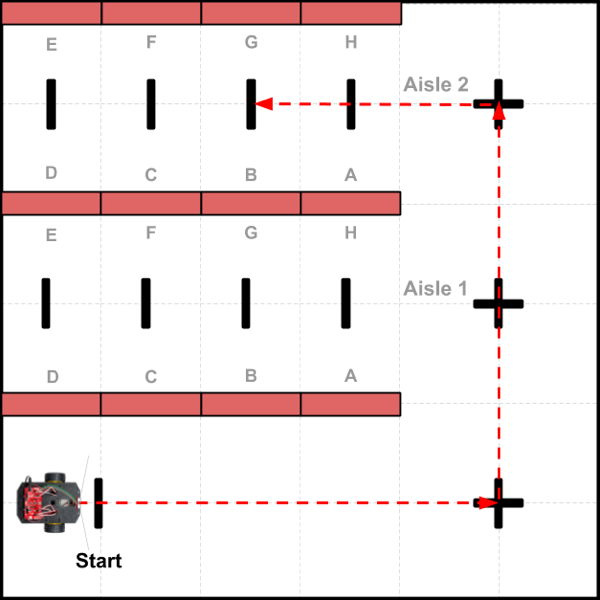

# Program Example 2 - Line Counting Nav

In this example, the robot will navigate by driving straight, counting lines it crosses, and turning \(or stopping\) at specific line counts. Your program will need to contain specific instructions that break down the navigation path into an ordered sequence of specific line counts and turns \(i.e., pivot angles\).

This navigation method is similar to the directions that a person might give you to get to a destination \(such as "Go straight. Then at the third light, turn left. Then go two more blocks, and turn right..."\).

## Example Scenario

The diagram below represents a scenario where a store robot will navigate through a set of store aisles \(red rectangles are cardboard boxes that represent store shelves\) to a specific location \(Shelf B in Aisle 2\), simulate delivering a box of items \(which a team member would do\), and then drive back to the stockroom \(labeled as "Start"\). The black lines and "plus signs" are line markers that the robot will use for navigation.



For the purposes of the demonstration, the distances traveled are much shorter than what would be required in an actual store environment.

## Example Program

Here is a possible way to code the program to demonstrate this particular scenario:

```cpp
/*
  Robot Demo - Example 2
  Drive in specific pattern using line counting navigation
*/

// SparkFun RedBot Library
#include <RedBot.h>

// create objects using classes in RedBot library
RedBotButton button;
RedBotMotors motors;
RedBotEncoder encoder(A2, 10);
RedBotSensor leftLine(A3);
RedBotSensor centerLine(A6);
RedBotSensor rightLine(A7);

// global variables for buzzer and LED pin numbers
const int buzzer = 9;
const int led = 13;

// global variables to keep track of which scenario to demonstrate
int scenario = 1;
boolean started = false;

// global variables for encoder counts and motor powers - used by driveStraight()
long leftCount, rightCount;
long prevLeftCount, prevRightCount;
int leftPower, rightPower;
const int motorPower = 150; // change value if needed

void setup() {
  pinMode(buzzer, OUTPUT);
  pinMode(led, OUTPUT);
  clearEncoders();
}

void loop() {
  checkButton();
  if (started == true) {
    if (scenario == 1) scenario1();
    else if (scenario == 2) scenario2();
    else if (scenario == 3) scenario3();
  }
}

// CUSTOM FUNCTIONS

void scenario1() {
  // Scenario 1: Drive through store to Shelf B in Aisle 2, deliver box, and return to start

  // drive from Start line to Aisle 2 line
  countLine(2); // Start line + lower right line (Aisle 0)
  pivotAngle(-90); // pivot -90 angle = turn left
  countLine(2); // Aisle 1 line + Aisle 2 line

  // drive to Shelf B line
  pivotAngle(-90);
  countLine(2); // A line + B line
  pivotAngle(-90); // turn to face Shelf B

  // Simulated Step - pause and deliver box
  alertSound();
  delay(3000); // wait 3 seconds for box to be delivered
  alertSound(); // make another alert before heading back

  // turn and drive back to Start
  pivotAngle(-90); // turn to exit Aisle 2
  countLine(2); // A line + Aisle 2 line
  pivotAngle(90); // pivot 90 angle = turn right
  countLine(2); // Aisle 1 line + lower right line
  pivotAngle(90);
  countLine(1); // next line is Start
  alertSound();

  // set global variables for next scenario
  scenario = 2;
  started = false;
}

void scenario2() {
  // add code for Scenario 2

  // set global variables for next scenario
  scenario = 3;
  started = false;
}

void scenario3() {
  // add code for Scenario 3

  // reset global variables for 1st scenario
  scenario = 1;
  started = false;
}

void checkButton() {
  // add code for this custom function
}

void alertSound() {
  // add code for this custom function
}

void clearEncoders() {
  // add code for this custom function
}

void driveStraight() {
  // add code for this custom function
}

void countLine(int target) {
  // add code for this custom function
}

void driveDistance(float distance, int power) {
  // add code for this custom function
}

void pivotAngle(float angle) {
  // add code for this custom function
}
```

## How Program Works

Here's how the program code works:

1. The SparkFun RedBot Library file is included in the program, so you can utilize the built-in classes and methods \(functions\) in this library that allow you to control the robot's motors, sensors, and other parts.
2. Object variables for the push button, motors, wheel encoders, and IR line sensors are created using classes contained in the RedBot library.
3. Global variables are declared and assigned for the buzzer and LED pin numbers, to keep track of which scenario to demonstrate \(and whether the robot has been "started" by pushing its button\), and to keep track of the encoder counts and motor powers. Global variables are also declared for the encoder counts and motor powers, which are necessary for the `driveStraight()` custom function.
4. The `setup()` function sets the pin modes for the buzzer and the LED. The `clearEncoders()` custom function is run by "calling" it by name.
5. The `loop()` function contains the main tasks that the robot performs:
   * A custom function named `checkButton()` checks whether the robot's button has been pushed. If that happens, the function changes the value of the global variable named `started` to become `true`. The reason for waiting for a button push is to allow your team to control the pace of the demonstration. For example, if your team needs to rearrange certain objects or obstacles between scenarios, the robot will wait until you push the button before starting the next scenario.
   * Next an `if` statement checks whether the value of `started` is `true`. If so, then it runs a different custom function \(such as: `scenario1()`, etc.\) depending on the current value of the global variable named `scenario` \(which was initially set to a value of `1`\). This allows your different scenarios to be performed in order.
   * Remember that the `loop()` function repeats itself over and over. In this case, it will keep checking to see if the button was pushed and if so, running the custom function for the correct scenario number.
6. A custom function named `scenario1()` contains all the code instructions for the first scenario in the demonstration, which is the scenario shown in the diagram above. The code instructions primarily consists of "calls" to other custom functions that perform specific tasks:
   * `countLine()` is a custom function that drives the robot in a straight path,  counting lines it crosses, and then stopping at a specific line number
   * `pivotAngle()` is a custom function that pivots \(turns\) the robot by a specific angle \(measured in degrees\)
   * `alertSound()` is a custom function that produces a specific sound pattern using the buzzer. Sounds are a great way to provide feedback when specific events or conditions occur during the demo. Sounds make it clear that the robot is acting intentionally.
   * Note that at the very end of `scenario1()`, the values of the global variables for `scenario` and `started` are changed to be ready for the next scenario \(which will wait to start until you push the button again\).
7. Custom functions for `scenario2()` and `scenario3()` are listed, but they are empty at the moment. You would need to add the specific code instructions for these scenarios, similar to the `scenario1()` instructions.
   * For example, maybe for Scenario 2, your team would show that the robot can travel to different shelves within the store aisles — or maybe you would show that the robot can make multiple stops to deliver boxes before heading back.
   * Maybe for Scenario 3, your team would demonstrate that your robot can avoid colliding with people \(or other obstacles\) in the aisles while still finding its way to its destination.
8. The program utilizes several pre-built custom functions that are listed in other sections of this project guidebook. In order for this program to work properly, you would need to add the full code for the following custom functions:
   * `checkButton()` — code listed in [Push Button](push-button.md#checkbutton-function) section
   * `alertSound()` — code listed in [Buzzer \(Speaker\)](buzzer-speaker.md#alertsound-function) section
   * `clearEncoders()` — code listed in [Wheel Encoders](wheel-encoders.md#clearencoders-function) section
   * `driveStraight()` — code listed in [Wheel Encoders](wheel-encoders.md#drivestraight-function) section
   * `countLine()` — code listed in [IR Line Sensors](ir-line-sensors.md#countline-function) section
   * `driveDistance()` — code listed in [Wheel Encoders](wheel-encoders.md#drivedistance-function) section 
   * `pivotAngle()` — code listed in [Wheel Encoders](wheel-encoders.md#pivotangle-function) section

Although this program is only an example, you could use it as a template to create your own program. At a minimum, you would need to modify the code instructions listed inside the `scenario1()` custom function — and also add the missing code for the other custom functions.

If you wanted to add other features to your robot demonstration, such as avoiding collisions using an ultrasonic sensor, then you would need to add other code into the program.

