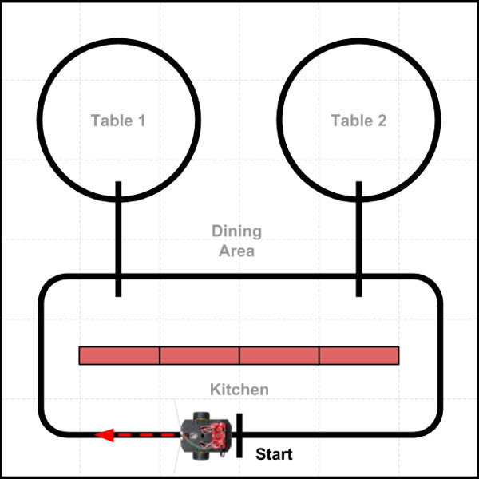

# Program Example 3 - Line Following Nav

In this example, the robot will navigate by following a line while also counting other lines it crosses, and then making turns \(or stops\) at specific line counts. Your program will need to contain code instructions that break down the navigation path into an ordered sequence of specific line counts and turns \(i.e., pivot angles\).

This navigation method is also similar to the directions that a person might give you to get to a destination \(such as "Follow this road as it curves around. Then at the third light, turn left. Follow that next road for two more blocks, and then turn right..."\).

## Example Scenario

The diagram below represents a scenario where a restaurant robot will deliver a food order from the kitchen out to Table 2, drive around the table \(delivering each person's order\), and then return to the kitchen. \(The red rectangles are cardboard boxes that represent a wall between the kitchen and dining area.\) The robot will follow the current line it is on while also counting other lines that it crosses, which help determine where it makes turns or stops. There is also a line marker \(labeled "Start"\) in the kitchen area, so the robot knows where to stop in the kitchen.



For the purposes of the demonstration, the distances traveled are much shorter than what would be required in an actual restaurant environment.

## Example Program

Here is a possible way to code the program to demonstrate this particular scenario:

```cpp
/*
  Robot Demo - Example 3
  Drive in specific pattern by following lines and counting lines crossed
*/

// SparkFun RedBot Library
#include <RedBot.h>

// create objects using classes in RedBot library
RedBotButton button;
RedBotMotors motors;
RedBotEncoder encoder(A2, 10);
RedBotSensor leftLine(A3);
RedBotSensor centerLine(A6);
RedBotSensor rightLine(A7);

// global variables for buzzer and LED pin numbers
const int buzzer = 9;
const int led = 13;

// global variables to keep track of which scenario to demonstrate
int scenario = 1;
boolean started = false;

// global variables for motor powers - used by followLine()
int leftPower, rightPower;

void setup() {
  pinMode(buzzer, OUTPUT);
  pinMode(led, OUTPUT);
}

void loop() {
  checkButton();
  if (started == true) {
    if (scenario == 1) scenario1();
    else if (scenario == 2) scenario2();
    else if (scenario == 3) scenario3();
  }
}

// CUSTOM FUNCTIONS

void scenario1() {
  // Scenario 1: Drive from kitchen to Table 2, drive around table, and return to start

  // drive from Start line to Table 2 line
  followCountLine(2); // 2nd line will be path to Table 2
  pivotAngle(-90); // pivot -90 angle = turn left
  followCountLine(1); // next line is the circle around table
  pivotAngle(-90);
  alertSound(); // food is here!
  followCountLine(1); // drive once around table

  // turn and return to kitchen
  pivotAngle(-90);
  followCountLine(1); // next line is main path
  pivotAngle(-90);
  followCountLine(1); // next line is Start
  alertSound(); // robot is ready for next order!

  // set global variables for next scenario
  scenario = 2;
  started = false;
}

void scenario2() {
  // add code for Scenario 2

  // set global variables for next scenario
  scenario = 3;
  started = false;
}

void scenario3() {
  // add code for Scenario 3

  // reset global variables for 1st scenario
  scenario = 1;
  started = false;
}

void checkButton() {
  // add code for this custom function
}

void alertSound() {
  // add code for this custom function
}

void followLine() {
  // add code for this custom function
}

void followCountLine(int target) {
  // add code for this custom function
}

void driveDistance(float distance, int power) {
  // add code for this custom function
}

void pivotAngle(float angle) {
  // add code for this custom function
}
```

## How Program Works

Here's how the program code works:

1. The SparkFun RedBot Library file is included in the program, so you can utilize the built-in classes and methods \(functions\) in this library that allow you to control the robot's motors, sensors, and other parts.
2. Object variables for the push button, motors, wheel encoders, and IR line sensors are created using classes contained in the RedBot library.
3. Global variables are declared and assigned for the buzzer and LED pin numbers, as well as to keep track of which scenario to demonstrate \(and whether the robot has been "started" by pushing its button\). Global variables are also declared for the left and right motor powers, which are necessary for the `followLine()` custom function.
4. The `setup()` function sets the pin modes for the buzzer and the LED.
5. The `loop()` function contains the main tasks that the robot performs:
   * A custom function named `checkButton()` checks whether the robot's button has been pushed. If that happens, the function changes the value of the global variable named `started` to become `true`. The reason for waiting for a button push is to allow your team to control the pace of the demonstration. For example, if your team needs to rearrange certain objects or obstacles between scenarios, the robot will wait until you push the button before starting the next scenario.
   * Next an `if` statement checks whether the value of `started` is `true`. If so, then it runs a different custom function \(such as: `scenario1()`, etc.\) depending on the current value of the global variable named `scenario` \(which was initially set to a value of `1`\). This allows your different scenarios to be performed in order.
   * Remember that the `loop()` function repeats itself over and over. In this case, it will keep checking to see if the button was pushed and if so, running the custom function for the correct scenario number.
6. A custom function named `scenario1()` contains all the code instructions for the first scenario in the demonstration, which is the scenario shown in the diagram above. The code instructions primarily consists of "calls" to other custom functions that perform specific tasks:
   * `followCountLine()` is a custom function that makes the robot follow the current line, count other lines it crosses, and then stop at a specific line number
   * `pivotAngle()` is a custom function that pivots \(turns\) the robot by a specific angle \(measured in degrees\)
   * `alertSound()` is a custom function that produces a specific sound pattern using the buzzer. Sounds are a great way to provide feedback when specific events or conditions occur during the demo. Sounds make it clear that the robot is acting intentionally.
   * Note that at the very end of `scenario1()`, the values of the global variables for `scenario` and `started` are changed to be ready for the next scenario \(which will wait to start until you push the button again\).
7. Custom functions for `scenario2()` and `scenario3()` are listed, but they are empty at the moment. You would need to add the specific code instructions for these scenarios, similar to the `scenario1()` instructions.
   * For example, maybe for Scenario 2, your team would show that the robot can travel to Table 1 instead — or maybe you would show that the robot can travel to both tables \(maybe to collect used plates\) before heading back to the kitchen.
   * Maybe for Scenario 3, your team would demonstrate that your robot can avoid colliding with people \(or other obstacles\) in the line paths while still finding its way to its destination.
8. The program utilizes several pre-built custom functions that are listed in other sections of this project guidebook. In order for this program to work properly, you would need to add the full code for the following custom functions:
   * `checkButton()` — code listed in [Push Button](push-button.md#checkbutton-function) section
   * `alertSound()` — code listed in [Buzzer \(Speaker\)](buzzer-speaker.md#alertsound-function) section
   * `followLine()` — code listed in [IR Line Sensors](ir-line-sensors.md#followline-function) section
   * `followCountLine()` — code listed in [IR Line Sensors](ir-line-sensors.md#followcountline-function) section
   * `driveDistance()` — code listed in [Wheel Encoders](wheel-encoders.md#drivedistance-function) section
   * `pivotAngle()` — code listed in [Wheel Encoders](wheel-encoders.md#pivotangle-function) section

Although this program is only an example, you could use it as a template to create your own program. At a minimum, you would need to modify the code instructions listed inside the `scenario1()` custom function — and also add the missing code for the other custom functions.

If you wanted to add other features to your robot demonstration, such as avoiding collisions using an ultrasonic sensor, then you would need to add other code into the program.

