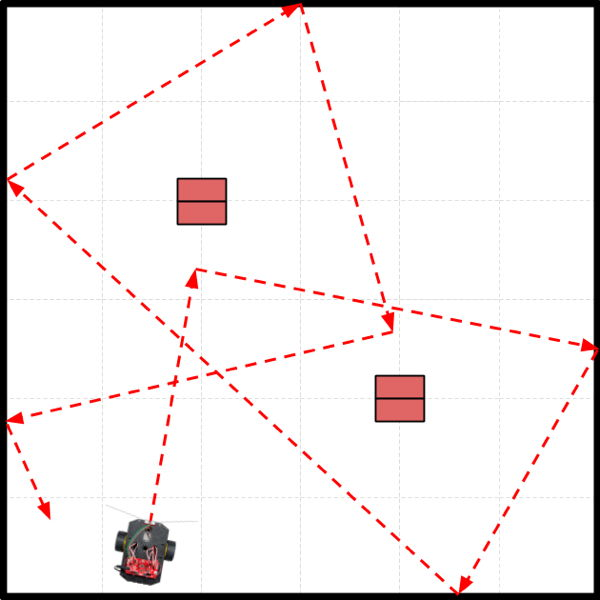

# Program Example 4 - Autonomous Nav

In this example, the robot will navigate by using its sensors to detect features in its environment \(such as obstacles, lines, etc.\) and then make decisions about what actions to take \(such as: stop, turn, drive, etc.\). Your program will need to contain code instructions that break down the navigation into an ordered sequence of specific behaviors that involve reading sensors, making decisions, and performing actions.

Autonomous navigation can be used to make your robot travel in a predictable pattern — or it can be used to allow your robot to travel in a more "random" pattern that still accomplishes the robot's intended tasks — or it can be used to give your robot "artificial intelligence" such as the [ability to solve mazes](http://www.instructables.com/id/Robot-Maze-Solver/), etc. It depends on how you decide to program the robot's behaviors for your scenario.

## Example Scenario

The diagram below represents a scenario where a security robot will patrol an area in a semi-random pattern. The robot will use its IR line sensors to avoid crossing the line around the area's perimeter. When the robot detects the line, the robot will pivot \(turn\) towards the interior of the area. In addition, the robot will use its ultrasonic sensor to avoid colliding with any obstacles within the area by pivoting away when they are too close. \(The red rectangles are cardboard boxes that represent obstacles.\)

In this scenario, every time the robot makes a turn, the angle is slightly random \(though within a certain range\), which makes the robot's pattern different every time the demonstration is run. \(Thus, the diagram only shows one possible path.\) The robot can be started from anywhere in the environment \(pointing in any direction\), and the robot will still perform its task of patrolling within the area while avoiding obstacles.



For the purposes of the demonstration, we will set the robot to patrol for a limited amount of time \(such as 30 seconds\) before stopping. In addition, the testing environment is obviously much smaller than what an actual security guard setting would require.

## Example Program

Here is a possible way to code the program to demonstrate this particular scenario:

```cpp
/*
  Robot Demo - Example 4
  Autonomous navigation by avoiding lines and obstacles
*/

// SparkFun RedBot Library
#include <RedBot.h>

// create objects using classes in RedBot library
RedBotButton button;
RedBotMotors motors;
RedBotEncoder encoder(A2, 10);
RedBotSensor leftLine(A3);
RedBotSensor centerLine(A6);
RedBotSensor rightLine(A7);

// global variables for buzzer and LED pin numbers
const int buzzer = 9;
const int led = 13;

// global variables for ultrasonic sensor pin numbers
const int TRIG_PIN = A0;
const int ECHO_PIN = A1;

// global variables to keep track of which scenario to demonstrate
int scenario = 1;
boolean started = false;

void setup() {
  pinMode(buzzer, OUTPUT);
  pinMode(led, OUTPUT);

  // ultrasonic sensor setup
  pinMode(TRIG_PIN, OUTPUT);
  pinMode(ECHO_PIN, INPUT);
  digitalWrite(TRIG_PIN, LOW);
}

void loop() {
  checkButton();
  if (started == true) {
    if (scenario == 1) scenario1();
    else if (scenario == 2) scenario2();
    else if (scenario == 3) scenario3();
  }
}

void scenario1() {
  // Scenario 1: Drive autonomously by avoiding lines and obstacles

  unsigned long time = millis(); // get current time in milliseconds
  unsigned long endTime = time + 30000; // make end time 30 seconds from now

  // while current time is less than end time, run demo
  while (time < endTime) {
    avoidLine();
    avoidCollision();
    time = millis(); // check current time again
  }

  // time's up
  motors.stop();
  alertSound();

  // set global variables for 2nd scenario
  scenario = 2;
  started = false;
}

void scenario2() {
  // add code for Scenario 2

  // set global variables for 3rd scenario
  scenario = 3;
  started = false;
}

void scenario3() {
  // add code for Scenario 3

  // reset global variables for 1st scenario
  scenario = 1;
  started = false;
}

void checkButton() {
  // add code for this custom function
}

void alertSound() {
  // add code for this custom function
}

void avoidLine() {
  // add code for this custom function
}

void avoidCollision() {
  // add code for this custom function
}

float measureDistance() {
  // add code for this custom function
}

void driveDistance(float distance, int power) {
  // add code for this custom function
}

void pivotAngle(float angle) {
  // add code for this custom function
}
```

## How Program Works

Here's how the program code works:

1. The SparkFun RedBot Library file is included in the program, so you can utilize the built-in classes and methods \(functions\) in this library that allow you to control the robot's motors, sensors, and other parts.
2. Object variables for the push button, motors, wheel encoders, and IR line sensors are created using classes contained in the RedBot library.
3. Global variables are declared and assigned for the buzzer and LED pin numbers, the ultrasonic sensor pin numbers, and to keep track of which scenario to demonstrate \(and whether the robot has been "started" by pushing its button\).
4. The `setup()` function sets the pin modes for the buzzer, LED, and ultrasonic sensor. A `digitalWrite()` command is used to make sure the ultrasonic sensor is turned off at the start.
5. The `loop()` function contains the main tasks that the robot performs:
   * A custom function named `checkButton()` checks whether the robot's button has been pushed. If that happens, the function changes the value of the global variable named `started` to become `true`. The reason for waiting for a button push is to allow your team to control the pace of the demonstration. For example, if your team needs to rearrange certain objects or obstacles between scenarios, the robot will wait until you push the button before starting the next scenario.
   * Next an `if` statement checks whether the value of `started` is `true`. If so, then it runs a different custom function \(such as: `scenario1()`, etc.\) depending on the current value of the global variable named `scenario` \(which was initially set to a value of `1`\). This allows your different scenarios to be performed in order.
   * Remember that the `loop()` function repeats itself over and over. In this case, it will keep checking to see if the button was pushed and if so, running the custom function for the correct scenario number.
6. A custom function named `scenario1()` contains all the code instructions for the first scenario in the demonstration, which is the scenario shown in the diagram above. The code instructions primarily consists of "calls" to other custom functions that perform specific tasks:
   * `millis()` is a built-in Arduino method that returns the current time in milliseconds since your program started running. It is basically a "stopwatch" that starts when your robot is turned on \(or reset\). For the purposes of the demo, we're using this to set an end time, so the first scenario only runs for 30 seconds.
   * `avoidLine()` is a custom function that drives the robot forward while checking for lines. If a line is detected, the robot is pivoted away from the line, in order to keep the robot within the outlined area.
   * `avoidCollision()` is a custom function that uses the ultrasonic sensor to measure the distance ahead to the nearest obstacle. When an obstacle is too close, it pivots the robot away from the obstacle.
   * `alertSound()` is a custom function that produces a specific sound pattern using the buzzer. Sounds are a great way to provide feedback when specific events or conditions occur during the demo. Sounds make it clear that the robot is acting intentionally.
   * Note that at the very end of `scenario1()`, the values of the global variables for `scenario` and `started` are changed to be ready for the next scenario \(which will wait to start until you push the button again\).
7. Custom functions for `scenario2()` and `scenario3()` are listed, but they are empty at the moment. You would need to add the specific code instructions for these scenarios, similar to the `scenario1()` instructions.
   * For example, maybe for Scenario 2, your team would demonstrate the robot patrolling in a specific pattern while also avoiding the lines and obstacles.
   * Maybe for Scenario 3, your team would demonstrate your robot guarding a doorway, detecting when someone approaches within a certain distance, and then driving towards the person while sounding an alarm.
8. The program utilizes several pre-built custom functions that are listed in other sections of this project guidebook. In order for this program to work properly, you would need to add the full code for the following custom functions:
   * `checkButton()` — code listed in [Push Button](push-button.md#checkbutton-function) section
   * `alertSound()` — code listed in [Buzzer \(Speaker\)](buzzer-speaker.md#alertsound-function) section
   * `avoidLine()` — code listed in [IR Line Sensors](ir-line-sensors.md#avoidline-function) section
   * `avoidCollision()` — code listed in [Ultrasonic Sensor](ultrasonic-sensor.md#avoidcollision-function) section
   * `measureDistance()` — code listed in [Ultrasonic Sensor](ultrasonic-sensor.md#measuredistance-function) section 
   * `driveDistance()` — code listed in [Wheel Encoders](wheel-encoders.md#drivedistance-function) section 
   * `pivotAngle()` — code listed in [Wheel Encoders](wheel-encoders.md#pivotangle-function) section

Although this program is only an example, you could use it as a template to create your own program. At a minimum, you might need to modify the code instructions listed inside the `scenario1()` custom function — and also add the missing code for the other custom functions.

If you wanted to add other features to your robot demonstration, such as detecting bumps using the accelerometer, then you would need to add other code into the program.

