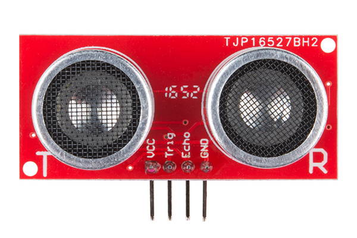
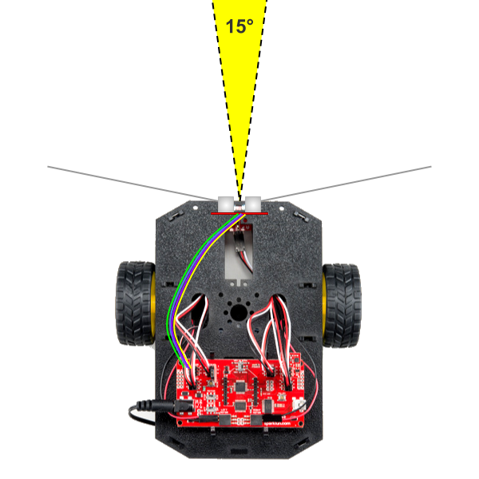
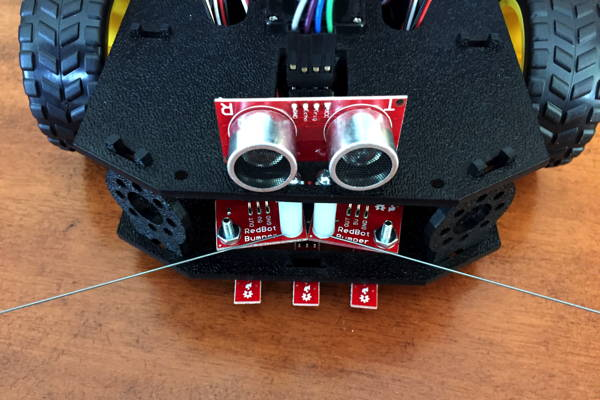
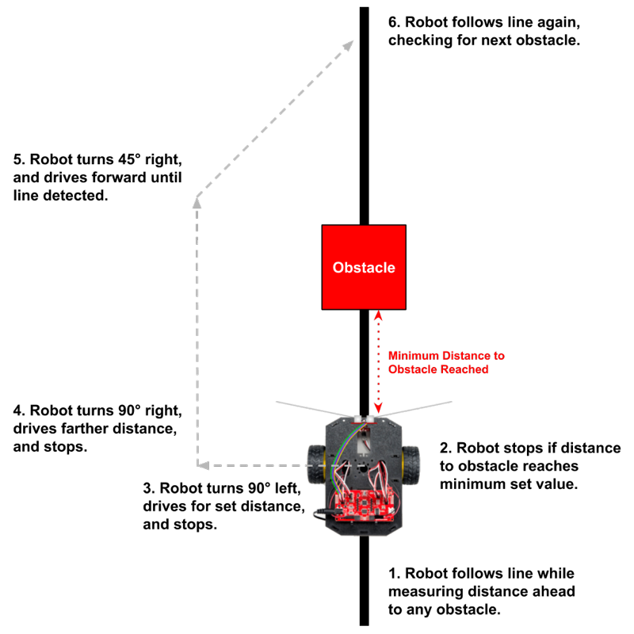

# Ultrasonic Sensor

You can add an ultrasonic sensor to your RedBot in order to detect obstacles from a distance \(before colliding with them\).

An ultrasonic sensor uses sonar to measure the distance to an object. The sensor has a speaker that transmits high-frequency sound, which cannot be heard by the human ear. The sensor also has a receiver \(i.e., a microphone\) that detects the echo of the high-frequency sound reflected back from an object. By measuring how much time it takes for the echo to arrive, you can calculate the distance between the RedBot and the object.

The way that the ultrasonic sensor works is similar to how certain types of animals, such as bats and dolphins, use [echolocation](https://en.wikipedia.org/wiki/Animal_echolocation) for navigation and hunting.



If you want to add an ultrasonic sensor to the front of your RedBot, you will need:

* [Ultrasonic Sensor HC-SR04](https://www.sparkfun.com/products/13959)
* [4 connected female-to-female jumper wires \(6" length\)](https://www.sparkfun.com/products/12796) — SparkFun sells these in packs of 20 connected wires, so one pack can be divided to provide sets of wires for 5 sensors \(5 teams\)
* [Velcro tape](https://www.walmart.com/ip/Self-Adhesive-Hook-Loop-Sticky-Back-Tape-Kit-From-5-to-50-Feet-Width-1-or-2/191948030) \(or double-sided foam tape\) — to mount the ultrasonic sensor at the front of the RedBot 

This ultrasonic sensor measures distances in a narrow cone of about 15° in front of the sensor. This sensor can detect obstacles located up to 400 cm away \(about 13 feet\). The distances calculated from the sensor measurements are very accurate, within about 3 mm \(about 0.1 inch\) of the actual distance.



The primary use of the ultrasonic sensor is to prevent collisions. If the sensor detects an obstacle nearby in the path ahead, the RedBot can be programmed to avoid the obstacle by stopping, turning, etc. This not only prevents collisions — it can allow the RedBot to navigate a "maze" of obstacles on its own.

### How to Use the Ultrasonic Sensor in a Program:

To use the ultrasonic sensor to measure distance, you will need to: 1. Declare variables to store the sensor's pin numbers 2. Set the pin modes for the sensor pins 3. Use a custom function to measure the distance to the closest object.

However, first you will need to physically connect and mount the ultrasonic sensor to the RedBot.

### Assembly Instructions in this Section:

* Connect Ultrasonic Sensor to Redbot Mainboard
* Mount Sensor to Front of RedBot Chassis

### Coding References in this Section:

* Declare Variables for Sensor Pin Numbers
* Set Pin Modes for Ultrasonic Sensor
* Measure Distance to Object
* **EXPERIMENT:** Test Ultrasonic Sensor Using Serial Monitor
* Avoid Collisions
* Avoid Collisions While Following Line
* Find Closest Object

## Connect Ultrasonic Sensor to RedBot Mainboard

Use a set of 4 connected female-to-female jumper wires to connect the ultrasonic sensor pins to the open pins in the front-left corner of the RedBot mainboard:

| Ultrasonic Sensor Pin | RedBot Pin |
| :--- | :--- |
| VCC | 5V |
| Trig | A0 |
| Echo | A1 |
| GND | GND |

For the 5V pin and GND pin on the RedBot, you can use the pins adjacent to A0 or A1 \(either side is fine\). This means that three wires will be connected on one side \(such as the A0 side\), while the other wire is connected to the analog pin on the other side \(such as A1\).

Your wires will have different colors. Use the wire colors to help verify that you are connecting the pins correctly.

## Mount Sensor to Front of RedBot Chassis

Use small pieces of velcro tape or foam tape to mount the ultrasonic sensor on top of the RedBot chassis towards the front. The sensor's transmitter and receiver should be positioned to face forward, like a pair of eyes. The sensor's wires should be pointing up \(and then will connect back to the RedBot mainboard\).

Velcro \("hook-and-loop"\) tape will allow you to remove the sensor if needed \(or to place it in a different position, such as the back of the RedBot\).

1. Take a section of velcro or foam tape about 1 inch × 0.5 inch, and cut it in half to form two pieces about 0.5 inch × 0.5 inch.
2. Attach one piece of tape under the sensor's transmitter and one piece of tape under the sensor's receiver. 
3. Press the sensor onto the front edge of the RedBot's top mounting plate, so the other side of the tape pieces will attach securely to the RedBot. Be sure the sensor is mounted to face forward, like a pair of eyes.



## Declare Variables for Sensor Pin Numbers

Before your `setup()` function, declare global variables to store the ultrasonic sensor's pin numbers:

```cpp
const int TRIG_PIN = A0;
const int ECHO_PIN = A1;
```

* `const` indicates that the variable will be a constant, which means its value won't change during the program.
* `int` indicates the variable type, which is an **integer** in this case. All Arduino pins are treated as integers \(even analog pins that have a letter in their pin number\).
* `TRIG_PIN` and `ECHO_PIN` represents the names of the variables that store the sensor's pin numbers.
* `A0` and `A1` indicate the pin numbers for the sensor's transmitter \(Trig\) and receiver \(Echo\). If necessary, change these to match the pins that your sensor is connected to.

## Set Pin Modes for Ultrasonic Sensor

Within your `setup()` function, use the `pinMode()` function to set the pin modes for the ultrasonic sensor's transmitter \(Trig\) and receiver \(Echo\):

```cpp
pinMode(TRIG_PIN, OUTPUT);
pinMode(ECHO_PIN, INPUT);
digitalWrite(TRIG_PIN, LOW);
```

Notice that a `digitalWrite()` statement was included to ensure the transmitter is turned off \(`LOW`\) when the program starts.

## Measure Distance to Object

Your program will have a custom function that uses readings from the ultrasonic sensor to measure the distance between the sensor and the closest object. The custom function will return the distance as a decimal value.

To get a distance measurement, your program will call this custom function named `measureDistance()` and assign the returned value to a local variable named `sensorDist`, which will have a data type of `float` \(i.e., a decimal number\).

This could be done in your `loop()` function \(or in your own custom function\):

```cpp
void loop() {

    float sensorDist = measureDistance();

    // add code to do something based on value of sensorDist

    delay(60); // need minimum 60 ms delay between sensor readings
}
```

You will need to decide what code to add that will do something with the sensor distance measurement. For example, if the distance is small \(such as less than 12 inches\), you most likely will want to make the RedBot motors brake. Then you may want to turn the RedBot left or right to see which direction might be obstacle-free \(by taking a new sensor measurement\) before driving forward again.

### measureDistance\(\) function

Be sure to include the custom function named `measureDistance()` after your `loop()` function:

```cpp
float measureDistance() {
    // HC-SR04 ultrasonic sensor   
    unsigned long start_time, end_time, pulse_time;

    // trigger ultrasonic signal for 10 microseconds
    digitalWrite(TRIG_PIN, HIGH);
    delayMicroseconds(10);
    digitalWrite(TRIG_PIN, LOW);

    // wait until echo received
    while (digitalRead(ECHO_PIN) == 0);

    // measure how long echo lasts (pulse time)
    start_time = micros(); // get start time in microseconds
    while (digitalRead(ECHO_PIN) == 1); // wait until echo pulse ends
    end_time = micros(); // get end time
    pulse_time = end_time - start_time; // subtract to get duration

    // pulse time of 23200 represents maximum distance for this sensor
    if (pulse_time > 23200) pulse_time = 23200;

    // calculate distance to object using pulse time
    float dist_cm = pulse_time / 58.0;
    float dist_in = pulse_time / 148.0;

    return dist_in; // or can return dist_cm
}
```

The comments in the custom function help explain how it works.

Note that this custom function starts with `float` instead of `void`:

* A function that does not return any value starts with `void`.  For example, the `setup()` and `loop()` functions start with `void` because they do not return values.
* A function that does return a value needs to indicate the data type \(such as `int`, `float`, `boolean`, etc.\) for the value. This custom function will return a `float` value \(decimal number\) representing the distance measurement.

If desired, you can modify the `return` statement at the end of the function to return the distance in units of centimeters \(instead of inches\).

## EXPERIMENT: Test Ultrasonic Sensor Using Serial Monitor

To test out your ultrasonic sensor, you can use the serial monitor to view the distance measurements calculated from the sensor readings.

Here is the program you can use for this experiment:

```cpp
/*
  Experiment: Test Ultrasonic Sensor Using Serial Monitor
*/

const int TRIG_PIN = A0;
const int ECHO_PIN = A1;

void setup() {
    pinMode(TRIG_PIN, OUTPUT);
    pinMode(ECHO_PIN, INPUT);
    digitalWrite(TRIG_PIN, LOW);

    // start serial connection to view sensor data
    Serial.begin(9600);
}

void loop() {

    float sensorDist = measureDistance();

    // send data to serial monitor
    Serial.print(sensorDist);
    Serial.println(" inches");

    delay(60); // need minimum 60 ms delay between sensor readings
}

// custom function
float measureDistance() {
    // HC-SR04 ultrasonic sensor   
    unsigned long start_time, end_time, pulse_time;

    // trigger ultrasonic signal for 10 microseconds
    digitalWrite(TRIG_PIN, HIGH);
    delayMicroseconds(10);
    digitalWrite(TRIG_PIN, LOW);

    // wait until echo received
    while (digitalRead(ECHO_PIN) == 0);

    // measure how long echo lasts (pulse time)
    start_time = micros(); // get start time in microseconds
    while (digitalRead(ECHO_PIN) == 1); // wait until echo pulse ends
    end_time = micros(); // get end time
    pulse_time = end_time - start_time; // subtract to get duration

    // pulse time of 23200 represents maximum distance for this sensor
    if (pulse_time > 23200) pulse_time = 23200;

    // calculate distance to object using pulse time
    float dist_cm = pulse_time / 58.0;
    float dist_in = pulse_time / 148.0;

    return dist_in; // or can return dist_cm
}
```

1. Create and save a new program in your Arduino code editor using the code above. Then upload the program to your RedBot.
2. After uploading the program to the RedBot, **keep the RedBot connected to your computer using the USB cable** \(because the serial data is transferred over USB\).
3. Open the Serial Monitor window in your Arduino code editor.
   * **Arduino Create Web Editor**: Click the "Monitor" menu in the left navigation panel.
   * **Arduino IDE Desktop Editor:** Under the "Tools" menu, select "Serial Monitor".
4. It may take a few seconds for the serial connection to be detected by the editor. Then you should see the distance measurements being displayed in the serial monitor window.
5. Place your hand \(or an object\) in front of the ultrasonic sensor, and move your hand \(or the object\) further or closer to verify that the distance measurements change and seem to be accurate. If necessary, use a ruler or measuring tape to verify the accuracy of the distance measurements.

Small objects \(such as your hand\) can be detected accurately if they are within about 24 inches. For farther distances, the object needs to be have a larger surface area to produce an accurate measurement \(large flat surfaces such as walls work really well\).

The sensor can accurately measure distances within the range of 2 cm to 400 cm \(about 1 inch to about 13 feet\). The distance measurement starts from the back of the sensor \(its board\).

## Avoid Collisions

One of the primary uses of the ultrasonic sensor is to detect obstacles from a distance and prevent collisions. Besides preventing collisions, it can be used to allow the RedBot to navigate a "maze" of obstacles on its own.

### avoidCollision\(\) function

Here is a custom function named `avoidCollision()` that will check the ultrasonic sensor reading and then perform a set of actions \(brake, turn, etc.\) if it detects the RedBot is about to collide with an obstacle:

```cpp
void avoidCollision() {

    // set minimum distance between RedBot and obstacle
    float minDist = 8.0; // change value as necessary (need decimal)

    // measure distance to nearest obstacle
    float sensorDist = measureDistance();

    // if obstacle is too close, avoid collision
    if (sensorDist <= minDist) {
        // add code to perform (brake, change direction, etc.)
        motors.brake();

    }
    delay(60); // need min 60ms between ultrasonic sensor readings
}
```

**IMPORTANT:** Be sure to also include the custom function `measureDistance()` in your program.

The custom function has a local variable named `minDist` set to a value of `8.0` inches. This is the minimum distance allowed between the RedBot and an obstacle. Once the minimum distance is reached, the RedBot needs to take action to avoid a collision.

If desired, you can increase or decrease the value of `minDist`. Just be sure to include a decimal point, since it is a `float` value.

**NOTE:** You will also need to decide what code to perform if the ultrasonic sensor detects a nearby obstacle. Most likely, the first thing that you should do is make the RedBot motors brake.

You could also make the RedBot produce a sound as feedback. This would be useful for testing your code by driving \(or rolling\) the RedBot towards an obstacle. What type of sound \(frequency, duration, number of beeps, etc.\) would make the most sense for an "warning" event like approaching an obstacle?

Finally, you will most likely need to make the RedBot change direction. Depending on the purpose of your RedBot, your solution to this problem will be different:

* Maybe the RedBot needs to simply turn around and proceed in the opposite direction.
* Maybe the RedBot will follow a simple rule such as always turn 90° and then proceed forward again.
* Maybe the RedBot just needs to change direction slightly and try moving forward again.
* Maybe the RedBot needs to navigate around the obstacle to try to maintain its original direction.
* etc.

In fact, you could pivot the RedBot and use the ultrasonic sensor to check the distance in different directions, in order to determine where there is an obstacle-free path.

## Avoid Collisions While Following Line

Avoiding obstacles while [following a line](ir-line-sensors.md#follow-line-automatically) is possible, but it presents an interesting challenge:

* When the RedBot detects that an obstacle is close by in the path ahead, the RedBot has to leave the line, detour around the obstacle, and then find the line again.

This diagram shows one possible solution to detour around an obstacle while following a line.



Notice in step 5 of the diagram that a 45° degree turn is made to angle back towards the line \(instead of making another 90° turn\). The reason for this is to make sure the right-hand IR line sensor will detect the line first, so the `followLine()` function can adjust the left and right motor powers to steer the RedBot to become centered on the line again. \(Otherwise, if the RedBot approaches the line at a 90° degree angle, the RedBot will simply drive over the line without correcting itself.\)

The code for the `loop()` function could be as simple as:

```cpp
void loop() {
    followLine();
    avoidCollision();
}
```

The code for detouring around any obstacles would be placed within the `avoidCollision()` custom function, which might look like this:

```cpp
void avoidCollision() {

    // set minimum distance between RedBot and obstacle
    float minDist = 8.0; // change value as necessary (need decimal)

    // set detour distance (should be larger than width and depth of obstacle)
    float detourDist = 12.0; // change value as necessary (need decimal)

    // measure distance to nearest obstacle
    float sensorDist = measureDistance();

    // if obstacle too close, avoid collision
    if (sensorDist <= minDist) {
        // code to detour around obstacle and get back to line
        motors.brake();
        pivotAngle(-90);
        driveDistance(detourDist, 100);
        pivotAngle(90);
        driveDistance(minDist + detourDist, 100);
        pivotAngle(45);
        motors.drive(100);
        // reset values of global variables for line following
        leftPower = 100;
        rightPower = 100; 
    }
    delay(60); // need min 60ms between ultrasonic sensor readings
}
```

This version of the `avoidCollision()` function has a local variable named `detourDist` set to a value of `12.0` inches. This represents how far the RedBot will detour around an obstacle, so this value needs to be larger than the width or depth \(whichever is larger\) of the actual obstacle. As needed, adjust the value of `detourDist` based on the size of your obstacles. Just be sure to include a decimal point, since it is a `float` value.

Be sure your program includes the other necessary code for the `followLine()`, `measureDistance()`, `pivotAngle()`, and `driveDistance()` custom functions.

**IMPORTANT:** Since the end of the `avoidCollision()` function already includes a built-in delay of 60 ms \(which is required for the ultrasonic sensor\), you should **remove** the delay that is normally included at the end of your `followLine()` function. \(Otherwise, including both delays will make the line following behavior less sensitive and more likely to make mistakes.\)

Again, the diagram and sample code shown above represent just one possible solution for avoiding obstacles while following a line. You might need to create a different solution that works better for your particular scenario.

## Find Closest Object

Another way to use the ultrasonic sensor is to scan the environment to find the closest object. Then the robot can drive towards the object and perform an action on the object \(perhaps a simulated step such as: pick up the object, analyze the object, etc.\).

### findClosestObject\(\) function

Here is a custom function named `findClosestObject()` that uses the ultrasonic sensor and wheel encoders to perform a 360 degree scan of the environment to find the closest object and then drive towards it.

To accomplish this, the robot perform two pivots:

1. The **first pivot** turns the robot 360 degrees to find the direction and distance to the closest object. The ultrasonic sensor is used to measure the distance to the object, while the wheel encoder count is used to indicate the "direction" of the object. Variables are used to compare the measurements from objects and keep track of which object is the closest.
2. The **second pivot** turns the robot to face the direction of the closest object found in the first pivot. Then the robot drives towards the object based the distance to the object.

In fact, much of the code within the `findClosestObject()` function is borrowed from the `pivotAngle()` function listed in the [Wheel Encoders](wheel-encoders.md) section.

```cpp
void findClosestObject() {

    /* Conducts 360 degree scan to find closest object
    Uses ultrasonic sensor to measure distance (every 60 ms) while pivoting for 360 degrees
    Remembers "direction" (wheel encoder count) and distance for the closest object
    After scan, robot pivots again to direction of closest object and drives towards it
    NOTE: It is normal for robot to not align perfectly with direction of object
    */

    // variables for pivot power and tracking wheel encoder count
    int power = 75; // slightly slower than normal pivot
    long rightCount = 0; // will track current wheel encoder count

    // variables for 360 degree scan
    float scanAngle = 360.0;
    float scanCorrection = -2.5; // change value based on test results
    scanAngle += scanCorrection; // add correction to scan angle

    // variables to track distance and encoder count for closest object
    float minDist = 157.0; // set to max range of ultrasonic sensor (157 in, 400 cm)
    long minCount = 0;

    // RedBot values based on encoders, motors & wheels
    float countsPerRev = 192.0; // 192 encoder ticks per wheel revolution
    float wheelDiam = 2.56; // wheel diameter = 65 mm = 2.56 in
    float wheelCirc = PI * wheelDiam; // wheel circumference = 3.14 x 2.56 in = 8.04 in
    float pivotDiam = 6.125; // pivot diameter = distance between centers of wheel treads = 6.125 in
    float pivotCirc = PI * pivotDiam; // pivot circumference = 3.14 x 6.125 in = 19.23 in

    // based on angle, calculate distance (arc length) for pivot
    float distance = abs(scanAngle) / 360 * pivotCirc;

    // based on distance, calculate number of wheel revolutions
    float numRev = distance / wheelCirc;

    // calculate target encoder count
    float targetCount = numRev * countsPerRev;

    // 1st PIVOT - 360 degree scan of environment
    // reset encoder counters and start pivoting
    encoder.clearEnc(BOTH);
    delay(100);
    motors.pivot(power);

    // keeps looping while right encoder count less than target count
    while (abs(rightCount) < abs(targetCount)) {

        // get ultrasonic sensor measurement
        float sensorDist = measureDistance();

        // see if measurement is new minimum distance
        if (sensorDist < minDist) {
            minDist = sensorDist;
            minCount = rightCount;
        }

        delay(60); // need min 60ms between ultrasonic sensor readings

        // get current wheel encoder count
        rightCount = encoder.getTicks(RIGHT);
    }

    // 360 SCAN COMPLETE - stop motors
    motors.brake();
    delay(500);

    // OPTIONAL: play sound to indicate scan complete
    int soundPin = 9;
    for (int i=0; i < 3; i++) {
        tone(soundPin, 4500);
        delay(100);
        noTone(soundPin);
        delay(100); // pause before next beep
    }

    // 2nd PIVOT - turn to face direction of closest object
    rightCount = 0;
    targetCount = minCount;

    // reset encoder counters and start pivoting
    encoder.clearEnc(BOTH);
    delay(100);
    motors.pivot(power);

    // keeps looping while right encoder count less than target count
    while (abs(rightCount) < abs(targetCount)) {
        delay(10); // very brief delay to continue pivoting
        rightCount = encoder.getTicks(RIGHT); // check count again
    }

    // 2nd PIVOT COMPLETE - stop motors
    motors.brake();
    delay(500);

    // DRIVE TOWARDS OBJECT - adjusts distance to avoid collision
    float buffer = 6.0; // buffer distance between robot and object
    if (minDist > buffer) driveDistance(minDist - buffer, 150);

    // OPTIONAL: play sound to indicate arrival at object
    tone(soundPin, 3000);
    delay(200);
    noTone(soundPin);
}
```

The variables named `minDist` and `minCount` are used to keep track of the closest object:

* During the first pivot \(i.e., the 360 degree scan\), each new ultrasonic measurement \(stored temporarily as `sensorDist`\) is compared to the current value for `minDist`.
* If the new distance measurement is smaller than `minDist`, then the new distance represents an even closer object — and the values of `minDist` and `minCount` get updated to match the values of this new closest object.
* After the full 360 degree scan is completed, `minCount` will indicate the "direction" of the closest object, and `minDist` will indicate the distance to that object. These values are used in the second pivot that point the robot towards the object.

**NOTE:** You will notice that a variable named `scanCorrection` is used to adjust the scan angle \(which is supposed to be 360 degrees\). This is needed if your RedBot is consistently pivoting too far \(or not far enough\). During testing, our RedBot was consistently pivoting about 2.5 degrees too far, which is why `scanCorrection` was assigned a value of `-2.5`.

1. Start by changing the value of `scanCorrection` to zero \(`0.0`\).
2. Conduct repeated tests to see how close the scanning pivot is to 360 degrees. \(If helpful, you could temporarily comment out the code for the second pivot.\)
3. Based on your test results, adjust the value assigned to `scanCorrection` to represent the number of degrees to use as a correction for the error:
   * If your RedBot is pivoting too far, use a negative value to correct the error.
   * If your RedBot is not pivoting far enough, use a positive value to correct the error.

There is also a variable named `buffer` that determines how close the robot should get when it drives towards the closest object. The value of `buffer` has been set to `6.0` inches to avoid a collision, but you can adjust this value if desired.

Finally, there are two places where **optional** code is included to play sounds: an alert sound is played after the 360 degree scan is completed, and another alert sound is played once the robot has driven towards the closest object. The code for these sounds can be modified or removed if desired.

**IMPORTANT:** The `findClosestObject()` function uses two other custom functions: `measureDistance()` and `driveDistance()`. Be sure your program includes the necessary code \(listed in a previous section above\) for the `measureDistance()` function. Be sure to [follow the instructions in the Wheel Encoder section](https://cxd.gitbooks.io/robotics-project/content/redbot-code-references/wheel-encoders.html) to include the necessary code for the `driveDistance()` function.

