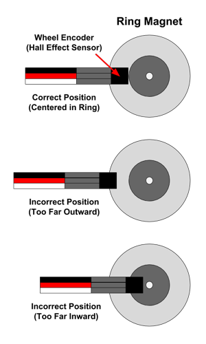

# Wheel Encoders

If you were to drive the RedBot motors at the same power, you would expect them to rotate at the same speed. However, you might notice that your RedBot drifts slightly to the left \(or right\) when you use the `motors.drive()` method. This is because your left and right motors might rotate at slightly different speeds, even though are being given the same amount of power.

The RedBot has wheel encoders that can measure exactly how many times the left and right motors have rotated. Over time, even a slight difference between the left and right motor rotations will add up and prevent the robot from traveling in a straight line. Fortunately, you can use the wheel encoders to help fix this issue \(by adjusting the power supplied to each motor\) and make your robot drive perfectly straight.


Each wheel encoder consists of a [Hall effect sensor](https://en.wikipedia.org/wiki/Hall_effect_sensor) that can measure the strength of a magnetic field. A ring magnet is attached to each RedBot motor. When the motor rotates the wheel, it also rotates the ring magnet. The Hall effect sensor positioned near the ring detects changes in the magnetic field as the ring rotates. This is how the sensor can measure how many times the motor has rotated.

**IMPORTANT:** In order to function accurately, the wheel encoder sensor must be positioned correctly. The sensor tip must be centered within the silver band of the ring magnet \(not too far inward or outward\) and must be close to the ring magnet's surface \(about ⅛" inch away\). You may need to push or pull the sensor to position it correctly. Even a small adjustment can affect its accuracy.


When you think of a magnet, you probably think of a magnet that has 2 poles: north and south. It is true that magnets have pairs of N-S poles. However, a magnet can be created with multiple pairs of N-S poles. The ring magnets attached to the RedBot motors each have 4 pairs of N-S poles, similar to the diagram below.


As the ring magnet completes one full rotation, the Hall effect sensor detects 4 changes \(or "ticks"\) in the magnetic field as the magnetic poles pass by the sensor.

Each rotation of the motor shaft only turns the wheel a certain number of degrees. The RedBot motors have a gearbox ratio of 48:1, which means it actually takes 48 rotations of the motor shaft to make the wheel complete one full revolution \(360°\).

We can use this information to calculate how many "ticks" of the wheel encoder represent one revolution of the wheel:

**4 ticks per motor rotation × 48 motor rotations per wheel revolution = 192 ticks per wheel revolution**

Based on the size of the RedBot's wheels, we can also calculate the distance that the RedBot travels during one wheel revolution. The distance is equal to the circumference of the wheel \(i.e., the distance around the outer edge of the wheel\). The circumference of a circle is its diameter multiplied by pi \(approximately 3.14\). Since the RedBot's wheels have a diameter of 65 mm \(2.56 inches\), the distance traveled per wheel revolution is:

**C = 𝛑 × d = 3.14 × 2.56 inches = 8.04 inches per wheel revolution**

So for your RedBot's wheel encoders, the following is true:

**192 ticks of wheel encoder = 1 wheel revolution = 8.04 inches traveled**

By keeping track of the total number of magnetic "ticks" for each motor, you can use the wheel encoders to help the RedBot perform several useful tasks: 1. **Drive in a straight line** by making small adjustments in the powers of the left and right motors, to make sure they rotate at the same average speed. 2. **Drive for a specific distance** by calculating how far the wheels have traveled. \(This is typically combined with adjusting the left and right motor powers to drive straight.\) 3. **Turn by a specific angle** by calculating how far a wheel has traveled while turning in a circle. This can be used for pivoting on both wheels or turning on one wheel.

### How to Use the Wheel Encoders in a Program:

To use the wheel encoders, you will need to: 1. Create `RedBotEncoder` object for the wheel encoders 2. Use the object's `clearEnc()` method to clear the encoder counters \(reset to zero\) 3. Add code to drive one or both motors 4. Use the object's `getTicks()` method to get the current encoder counts 5. Add code to perform an action based on the encoder counts \(e.g., adjust motor powers, stop motors, etc.\)

### Coding References in this Section:

* Create RedBotEncoder Objects
* Clear Encoder Counters
* Get Current Encoder Counts
* Use Serial Monitor to View Encoder Counts
* Drive Straight Continuously
* Drive Straight for Specific Distance
* Pivot Both Wheels by Specific Angle
* Turn on One Wheel by Specific Angle

## Create RedBotEncoder Object

The SparkFun `RedBot` library has a class named `RedBotEncoder` which contains methods \(functions\) to control the wheel encoders.

**IMPORTANT:** Be sure that your program includes a copy of the SparkFun `RedBot` library. If necessary, see the instructions for [how to include the RedBot library](redbot-library.md).

Before your `setup()` function, create a `RedBotEncoder` object by assigning it to a variable and indicating the pin numbers for the encoders:

```cpp
RedBotEncoder encoder(A2, 10);
```

* `RedBotEncoder` indicates the class of object being created \(this class is part of the `RedBot` library\)
* `encoder` represents the variable name for the `RedBotEncoder` object. If desired, you could use a different variable name.
* `A2` and `10` indicate the pin numbers \(in order\) that the left and right wheel encoders are connected to.

## Clear Encoder Counters

The `RedBotEncoder` object has counters to keep track of how many total magnetic "ticks" have been detected by each wheel encoder.

Before using the wheel encoders, you will typically want to clear the counters by resetting them to zero.

Use the `clearEnc()` function to clear the encoder counter:

```cpp
encoder.clearEnc(BOTH);
```

* `encoder` represents the variable name of the `RedBotEncoder` object. If necessary, change this to the variable name you used.
* `BOTH` indicates that the counters for both encoders should be cleared \(reset to zero\). If it were necessary, you could instead use `LEFT` or `RIGHT` to only clear the counter for a particular encoder.

## Get Current Encoder Counts

The `RedBotEncoder` object has a `getTicks()` method that returns the current number of magnetic "ticks" that have been detected by each wheel encoder, as the motors rotate.

Since you will typically want to compare the readings from both encoders at the same time, your program should store the sensor readings in local variables, and then use the readings to perform an action:

```cpp
// add code to drive one or both motors

// get current wheel encoder readings
long leftCount = encoder.getTicks(LEFT);
long rightCount = encoder.getTicks(RIGHT);

// add code to do something based on encoder readings
```

* `long` indicates the variable type, which is a **long integer** in this case.
* `leftCount` and `rightCount` represent the variable names for the left and right encoder counts. If desired, you could use different variable names.
* `LEFT` or `RIGHT` are used to get the current count for either the left or right encoder.

The count for each encoder represents the cumulative total number of "ticks" since that encoder was last cleared.

**NOTE:** The wheel encoder counter will detect "ticks" whether the motor is driving forwards or backwards. If the motor is driving forwards, its encoder counter will increase. However, if the motor is driving backwards, its encoder counter will **decrease** \(each "tick" counts as -1\).

## Use Serial Monitor to View Encoder Counts

To test out your wheel encoders, you can view the encoder counts using the serial monitor in the Arduino code editor. This is also a good way to verify your wheel encoders are positioned correctly to accurately count the magnetic "ticks" as the motor rotates.

### 1. Start Serial Connection

Add this code into your `setup()` function to start a serial connection between your RedBot and the code editor:

```cpp
// start serial connection to view sensor data
Serial.begin(9600);
```

### 2. Send Data Over Serial Connection

Add this custom function named `testLineSensors()` after your `loop()` function. This custom function will send \(print\) the sensor measurements over the serial connection:

### testWheelEncoders\(\) function

```cpp
void testWheelEncoders() {

    // wait for button press to start driving
    if (button.read() == true) {
        encoder.clearEnc(BOTH); // reset counters
        motors.drive(150);
    }

    long leftCount = encoder.getTicks(LEFT);
    long rightCount = encoder.getTicks(RIGHT);

    // send data to serial monitor
    Serial.print("L: ");
    Serial.print(leftCount);
    Serial.print("\tR: ");
    Serial.println(rightCount);

    // if either count reaches 1000, brake motors
    if (leftCount >= 1000 || rightCount >= 1000) motors.brake();
}
```

Then be sure to call this custom function in your `loop()` function:

```cpp
void loop() {
    testWheelEncoders();
}
```

**NOTE:** Be sure that your program also contains the necessary code to create a `RedBotButton` object named `button`.

### 3. View Data in Serial Monitor

After uploading the program to the RedBot, **keep the RedBot connected to your computer using the USB cable** \(because the serial data is transferred over USB\).

Open the Serial Monitor window in your Arduino code editor:

* **Arduino Create Web Editor**: Click the "Monitor" menu in the left navigation panel.
* **Arduino IDE Desktop Editor:** Under the "Tools" menu, select "Serial Monitor".

It may take a few seconds for the serial connection to be detected by the editor. Then you should see the encoder counts being displayed in the serial monitor window.

Try the following tests to see how the encoder counts change:

* Place the RedBot's back end on a table, so that the RedBot stands vertically with its wheels in the air. Manually turn each wheel \(which will turn the motor\) to watch the wheel's encoder count change in the serial monitor. Remember that every 192 "ticks" should represent one complete revolution of the wheel.
* While the RedBot is still standing vertically on the table, carefully press its push button \(next to the USB port\). The motors will start driving. Watch the wheel encoder counts change in the serial monitor. Once either encoder reaches a count of 1000 \(slightly more than 5 wheel revolutions\), the motors will brake. Notice that your left and right encoder counts might not match exactly. Also notice that your RedBot might overshoot a count of 1000, as it takes a small amount of time to actually brake the motors to stop the rotation. Push the button again to see how the counts compare to your previous trial. By how much do the motors "overshoot" the target count of 1000? How close are the left and right counts to each other? Does one motor rotate faster than the other? Push the button again to conduct another test trial. Conduct several trials to see how the counts vary.
* When you manually turn the wheels, you will notice that the counter will increase whether you turn the wheel clockwise or counter-clockwise. However, when you drive the motors using your program, a wheel's encoder count will only increase if the motor is driving the wheel forwards. If the motor is driving the wheel backwards, its encoder count will decrease \(and can become a negative count\). To test this, modify your `testWheelEncoder()` function by changing `motors.drive(150);` to `motors.pivot(150);` which will make the left motor drive forwards, while the right motor drives backwards. Run the modified program to verify that the left count increases, while the right count decreases.
* **TROUBLESHOOTING:** If either encoder count doesn't seem to be changing as the motor rotates, check the position of the wheel encoder sensor. The sensor tip must be centered within the silver band of the ring magnet \(not too far inward or outward\) and must be close to the ring magnet's surface \(about ⅛" inch away\). Otherwise, it may not detect the magnetic "ticks" accurately. You may need to push or pull the encoder to position it accurately. Even a small adjustment can affect its accuracy. If the encoder is pushed too far inward, use the flat-tipped screwdriver included in your RedBot kit to gently push the encoder back into the correct position.



**NOTE:** When you change the batteries in your RedBot's battery pack, it is easy to accidentally push the wheel encoder wires. So every time after changing the batteries, check the positions of the wheel encoder sensors and adjust them if necessary.

## Drive Straight Continuously

Driving perfectly straight requires the left and right motors to rotate at the same rate. If your RedBot drifts slightly to the left \(or right\) when driving, then your motors are not rotating at the exact same rate \(even though you may be using the same power for each motor\).

You can compare the left and right wheel encoder counts as your RedBot drives to see whether they are the same or not. If they aren't the same, the left and right motor powers can be individually adjusted to make the encoder counts more similar. The result is that your RedBot will drive in straight line.

A custom function named `driveStraight()` can be used to make your RedBot drive straight continuously. You'll probably need to combine this with other commands that will make your RedBot avoid obstacles \(or lines, etc.\) by braking or turning.

The `driveStraight()` custom function relies on several global variables that are used to track the wheel encoders counts, as well as the powers for the left and right motors.

Add this code before your `setup()` function to declare these global variables:

```cpp
// variables for wheel encoder counts and motor powers
long leftCount, rightCount;
long prevLeftCount, prevRightCount;
int leftPower, rightPower;
const int motorPower = 150; // change value if needed - used by driveStraight() function
```

The code above sets the average motor power for the RedBot's driving to a value of `150`. If needed, change this value for your program.

You'll also use another custom function named `clearEncoders()` that will reset the wheel encoder counters back to zero and reset the values of these global variables.

### clearEncoders\(\) function

Add the `clearEncoders()` function after your `loop()` function:

```cpp
void clearEncoders() {
    // call this function in setup() and after any turn or pivot
    encoder.clearEnc(BOTH);
    leftCount = 0;
    rightCount = 0;
    prevLeftCount = 0;
    prevRightCount = 0;
    leftPower = motorPower;
    rightPower = motorPower;
}
```

The `clearEncoders()` function will need to be called **before** you can start driving your RedBot in a straight line.

Add this code inside your `setup()` function to call this function:

```cpp
clearEncoders();
```

**IMPORTANT:** If your RedBot needs to turn or pivot \(e.g., to avoid an obstacle, to change direction, etc.\), then you will need to call the `clearEncoders()` function again after the turn or pivot is complete.

### driveStraight\(\) function

Add the `driveStraight()` function after your `loop()` function:

```cpp
void driveStraight() {

    // use wheel encoders to drive straight continuously

    // amount to offset motor powers to drive straight
    int offset = 5;

    // get current wheel encoder counts
    leftCount = encoder.getTicks(LEFT);
    rightCount = encoder.getTicks(RIGHT);

    // calculate increase in count from previous reading
    long leftDiff = leftCount - prevLeftCount;
    long rightDiff = rightCount - prevRightCount;

    // store current counts as "previous" counts for next reading
    prevLeftCount = leftCount;
    prevRightCount = rightCount;

    // adjust left & right motor powers to keep counts similar (drive straight)

    // if left rotated more than right, slow down left & speed up right
    if (leftDiff > rightDiff) {
        leftPower = leftPower - offset;
        rightPower = rightPower + offset;
    }
    // else if right rotated more than left, speed up left & slow down right
    else if (leftDiff < rightDiff) {
        leftPower = leftPower + offset;
        rightPower = rightPower - offset;
    }

    // apply adjusted motor powers
    motors.leftDrive(leftPower);
    motors.rightDrive(rightPower);
    delay(10);  // short delay before next reading
}
```

Then you will call the `driveStraight()` function inside your `loop()` function:

```cpp
void loop() {

    driveStraight();

    // add other code to check for obstacles, turn, etc.

}
```

Again, you will probably want to add other code inside the `loop()` function to check for obstacles, etc.

**REMINDER:** If your code makes the RedBot turn or pivot, then be sure to call the `clearEncoders()` function again after the turn or pivot is complete. You can add this at the end of the `pivotAngle()` or `turnAngle()` functions.

## Drive Straight for Specific Distance

You can also use the wheel encoder counts to stop the RedBot after it has driven for a specific distance.

A custom function named `driveDistance()` can be used to make your RedBot drive straight for a specified distance at a specified average motor power.

When calling this custom function, you must pass in a value for the **distance** \(inches\) and **power** \(between 0-255\). For example, to make your RedBot drive 24 inches at an average motor power of 150:

```cpp
driveDistance(24, 150);
```

You can even drive backwards by passing in a negative value for the distance:

```cpp
driveDistance(-12, 150);
```

**NOTE:** The `driveDistance()` function does not require declaring global variables for the wheel encoders counts or the left and right motor powers. Instead, all these variables are declared inside the function as local variables. Furthermore, the `clearEncoders()` function is not required because the encoders and variables are reset within the `driveDistance()` function itself.

### driveDistance\(\) function

Add the `driveDistance()` function after your `loop()` function:

```cpp
void driveDistance(float distance, int power) {

    // use wheel encoders to drive straight for specified distance at specified power

    // set initial power for left and right motors
    int leftPower = power;
    int rightPower = power;

    // amount to offset motor powers to drive straight
    int offset = 5;

    // if negative distance, make powers & offset also negative
    if (distance < 0) {
        leftPower *= -1;
        rightPower *= -1;
        offset *= -1;
    }

    // adjust distance to improve accuracy
    float correction = -1.0; // change value based on test results
    if (distance > 0) distance += correction;
    else if (distance < 0) distance -= correction;

    // variables for tracking wheel encoder counts
    long leftCount = 0;
    long rightCount = 0;
    long prevLeftCount = 0;
    long prevRightCount = 0;
    long leftDiff, rightDiff;

    // RedBot values based on encoders, motors & wheels
    float countsPerRev = 192.0; // 192 encoder ticks per wheel revolution
    float wheelDiam = 2.56;  // wheel diameter = 65 mm = 2.56 in
    float wheelCirc = PI * wheelDiam; // wheel circumference = 3.14 x 2.56 in = 8.04 in

    // based on distance, calculate number of wheel revolutions
    float numRev = distance / wheelCirc;

    // calculate target encoder count
    float targetCount = numRev * countsPerRev;

    // reset encoder counters and start driving
    encoder.clearEnc(BOTH);
    delay(100);
    motors.leftDrive(leftPower);
    motors.rightDrive(rightPower);

    // keeps looping while right encoder count less than target count
    while (abs(rightCount) < abs(targetCount)) {

        // get current wheel encoder counts
        leftCount = encoder.getTicks(LEFT);
        rightCount = encoder.getTicks(RIGHT);

        // calculate increase in count from previous reading
        leftDiff = abs(leftCount - prevLeftCount);
        rightDiff = abs(rightCount - prevRightCount);

        // store current counts as "previous" counts for next reading
        prevLeftCount = leftCount;
        prevRightCount = rightCount;

        // adjust left & right motor powers to keep counts similar (drive straight)

        // if left rotated more than right, slow down left & speed up right
        if (leftDiff > rightDiff) {
            leftPower = leftPower - offset;
            rightPower = rightPower + offset;
        }
        // else if right rotated more than left, speed up left & slow down right
        else if (leftDiff < rightDiff) {
            leftPower = leftPower + offset;
            rightPower = rightPower - offset;
        }

        // apply adjusted motor powers
        motors.leftDrive(leftPower);
        motors.rightDrive(rightPower);
        delay(10);  // short delay before next reading
    }

    // target count reached
    motors.brake(); // or use: motors.stop()
    delay(500); // brief delay to wait for complete stop
}
```

**NOTE:** You will notice that a variable named `correction` is used to adjust the distance. This is needed if your RedBot is consistently driving too far \(or not far enough\). During testing, our RedBot was consistently driving about 1 inch too far, which is why `correction` was assigned a value of `-1.0`.

1. Start by changing the value of `correction` to zero \(`0.0`\).
2. Conduct repeated tests using the custom function to drive your RedBot to various distances \(such as 12, 24, 36, etc.\). Use a ruler or tape measure to measure the actual distance your RedBot drives. What is the average amount of error \(in inches\)?
3. Based on your test results, adjust the value assigned to `correction` to represent the number of inches to use as a correction for the error:
   * If your RedBot is driving too far, use a negative value to correct the error.
   * If your RedBot is not driving far enough, use a positive value to correct the error.

## Pivot Both Wheels by Specific Angle

The wheel encoders can also be used to pivot \(turn\) your RedBot by a specific angle by measuring the distance traveled while pivoting.

When pivoting, the RedBot turns in a circle that is centered between its wheels. The distance between the centers of the RedBot wheel treads is 6.125 inches, which represents the diameter of its pivot circle. If the RedBot pivoted 360°, the distance traveled by each wheel would be equal to the circumference of this pivot circle:

**C = 𝛑 × d = 3.14 × 6.125 = 19.23 inches**

Usually you will want your RedBot to pivot by a specific angle that is less than 360° — such as 45°, 90°, 180°, etc. Based on the specific angle, you can calculate its **arc length** \(i.e., a "partial circumference"\):

**L = 𝛂 / 360° × 𝛑 × d**

The arc length \(L\) represents the distance that each wheel will travel while pivoting by that specific angle \(𝛂\).

For example, when pivoting by 90°, the arc length is:

L = 90° / 360° × 𝛑 × d = 0.25 × 3.14 × 6.125 = 4.81 inches

A custom function named `pivotAngle()` can be used to make your RedBot pivot by a specified angle. The custom function calculates the arc length for the specified angle, which represents how far the wheels must travel while pivoting. The wheel encoders are used to stop the pivoting once that distance has been reached.

When calling this custom function, you must pass in a value for the **angle** \(degrees\). A positive value will pivot the RedBot clockwise to the right. A negative value will pivot the RedBot counter-clockwise to the left.

For example, to make your RedBot pivot 90 degrees clockwise to the right:

```cpp
pivotAngle(90);
```

To make your RedBot pivot 90 degrees counter-clockwise to the left:

```cpp
pivotAngle(-90);
```

### pivotAngle\(\) function

Be sure to include the custom function after your `loop()` function:

```cpp
void pivotAngle(float angle) {

    // use wheel encoders to pivot (turn) by specified angle

    // set motor power for pivoting
    int power = 100; // turn CW
    if (angle < 0) power *= -1; // use negative power to turn CCW

    // adjust angle to improve accuracy
    float correction = -5.0; // change value based on test results
    if (angle > 0) angle += correction;
    else if (angle < 0) angle -= correction;

    // variable for tracking wheel encoder counts
    long rightCount = 0;

    // RedBot values based on encoders, motors & wheels
    float countsPerRev = 192.0; // 192 encoder ticks per wheel revolution
    float wheelDiam = 2.56; // wheel diameter = 65 mm = 2.56 in
    float wheelCirc = PI * wheelDiam; // wheel circumference = 3.14 x 2.56 in = 8.04 in
    float pivotDiam = 6.125; // pivot diameter = distance between centers of wheel treads = 6.125 in
    float pivotCirc = PI * pivotDiam; // pivot circumference = 3.14 x 6.125 in = 19.23 in

    // based on angle, calculate distance (arc length)
    float distance = abs(angle) / 360 * pivotCirc;

    // based on distance, calculate number of wheel revolutions
    float numRev = distance / wheelCirc;

    // calculate target encoder count
    float targetCount = numRev * countsPerRev;

    // reset encoder counters and start pivoting
    encoder.clearEnc(BOTH);
    delay(100);
    motors.pivot(power);

    // keeps looping while right encoder count less than target count
    while (abs(rightCount) < abs(targetCount)) {
        // get current wheel encoder count
        rightCount = encoder.getTicks(RIGHT);
        delay(10);  // short delay before next reading
    }

    // target count reached
    motors.brake();
    delay(250);
    // clearEncoders(); // only needed if using driveStraight() or countLine()
}
```

**NOTE:** You will notice that a variable named `correction` is used to adjust the angle. This is needed if your RedBot is consistently pivoting too far \(or not far enough\). During testing, our RedBot was consistently pivoting about 5 degrees too far, which is why `correction` was assigned a value of `-5.0`.

1. Start by changing the value of `correction` to zero \(`0.0`\).
2. Conduct repeated tests using the custom function to pivot your RedBot to various angles \(such as 90, 180, -90, etc.\). Use a protractor to measure the actual angle your RedBot pivots. What is the average amount of error \(in degrees\)?
3. Based on your test results, adjust the value assigned to `correction` to represent the number of degrees to use as a correction for the error:
   * If your RedBot is pivoting too far, use a negative value to correct the error.
   * If your RedBot is not pivoting far enough, use a positive value to correct the error.

## Turn on One Wheel By Specific Angle

You can also make your RedBot turn by driving one wheel while the other wheel is stopped. In this case, the RedBot rotates in a circle that is centered on the stopped wheel. This type of turn is less tight than pivoting, but it helps retain the forward momentum of the robot.

Here is a visual comparison of pivoting on both wheels versus turning on one wheel:


When turning on one wheel, the RedBot turns in a circle that is centered on the stopped wheel. The distance between the centers of the RedBot wheel treads is 6.125 inches, which represents the radius of this turn circle. So the diameter of the turn circle is twice the radius - i.e., 12.25 inches. If the RedBot turned 360°, the distance traveled by the driving wheel would be equal to the circumference of this turn circle:

**C = 𝛑 × d = 3.14 × 12.25 = 38.47 inches**

Usually you will want your RedBot to turn by a specific angle that is less than 360° — such as 45°, 90°, 180°, etc. Based on the specific angle, you can calculate its **arc length** \(i.e., a "partial circumference"\):

**L = 𝛂 / 360° × 𝛑 × d**

The arc length \(L\) represents the distance that the driving wheel will travel while turning by that specific angle \(𝛂\).

For example, when turning on one wheel by 90°, the arc length is:

L = 90° / 360° × 𝛑 × d = 0.25 × 3.14 × 12.25 = 9.62 inches

A custom function named `turnAngle()` can be used to make your RedBot turn on one wheel by a specified angle. The custom function calculates the arc length for the specified angle, which represents how far the driving wheel must travel while turning. The wheel encoders are used to stop the turning once that distance has been reached.

When calling this custom function, you must pass in a value for the **angle** \(degrees\). A positive value will turn the RedBot clockwise to the right. A negative value will turn the RedBot counter-clockwise to the left.

For example, to make your RedBot turn on one wheel 90 degrees clockwise to the right:

```cpp
turnAngle(90);
```

To make your RedBot turn on one wheel 90 degrees counter-clockwise to the left:

```cpp
turnAngle(-90);
```

### turnAngle\(\) function

Be sure to include the custom function after your `loop()` function:

```cpp
void turnAngle(float angle) {

    // use wheel encoders to turn on one wheel by specified angle

    // set motor power for pivoting
    int power = 100;

    // adjust angle to improve accuracy
    float correction = 5.0; // change value based on test results
    if (angle > 0) angle += correction;
    else if (angle < 0) angle -= correction;

    // variable for tracking wheel encoder counts
    long leftCount = 0;
    long rightCount = 0;

    // RedBot values based on encoders, motors & wheels
    float countsPerRev = 192.0; // 192 encoder ticks per wheel revolution
    float wheelDiam = 2.56; // wheel diameter = 65 mm = 2.56 in
    float wheelCirc = PI * wheelDiam; // wheel circumference = 3.14 x 2.56 in = 8.04 in
    float turnDiam = 12.25; // turn diameter = 2 x distance between centers of wheel treads = 2 x 6.125 in
    float turnCirc = PI * turnDiam; // turn circumference = 3.14 x 12.25 in = 38.47 in

    // based on angle, calculate distance (arc length)
    float distance = abs(angle) / 360 * turnCirc;

    // based on distance, calculate number of wheel revolutions
    float numRev = distance / wheelCirc;

    // calculate target encoder count
    float targetCount = numRev * countsPerRev;

    // reset encoder counters
    encoder.clearEnc(BOTH);
    delay(100);

    if (angle > 0) {
        // turn clockwise using left wheel
        motors.rightStop();
        motors.leftDrive(power);

        // keeps looping while left encoder count less than target count
        while (leftCount < targetCount) {
            // get current wheel encoder count
            leftCount = encoder.getTicks(LEFT);
            delay(10);  // short delay before next reading
        }
    }
    else {
        // turn counter-clockwise using right wheel
        motors.leftStop();
        motors.rightDrive(power);

        // keeps looping while right encoder count less than target count
        while (rightCount < targetCount) {
            // get current wheel encoder count
            rightCount = encoder.getTicks(RIGHT);
            delay(10); // short delay before next reading
        } 
    }

    // target count reached
    motors.stop();
    delay(250);

    // only if using driveStraight() or countLine() elsewhere in program
    // clearEncoders();
}
```

**NOTE:** You will notice that a variable named `correction` is used to adjust the angle. This is needed if your RedBot is consistently turning too far \(or not far enough\). During testing, our RedBot was consistently turning about 5 degrees too little, which is why `correction` was assigned a value of `5.0`.

1. Start by changing the value of `correction` to zero \(`0.0`\).
2. Conduct repeated tests using the custom function to turn your RedBot to various angles \(such as 90, 180, -90, etc.\). Use a protractor to measure the actual angle your RedBot turns. What is the average amount of error \(in degrees\)?
3. Based on your test results, adjust the value assigned to `correction` to represent the number of degrees to use as a correction for the error:
   * If your RedBot is turning too far, use a negative value to correct the error.
   * If your RedBot is not turning far enough, use a positive value to correct the error.

